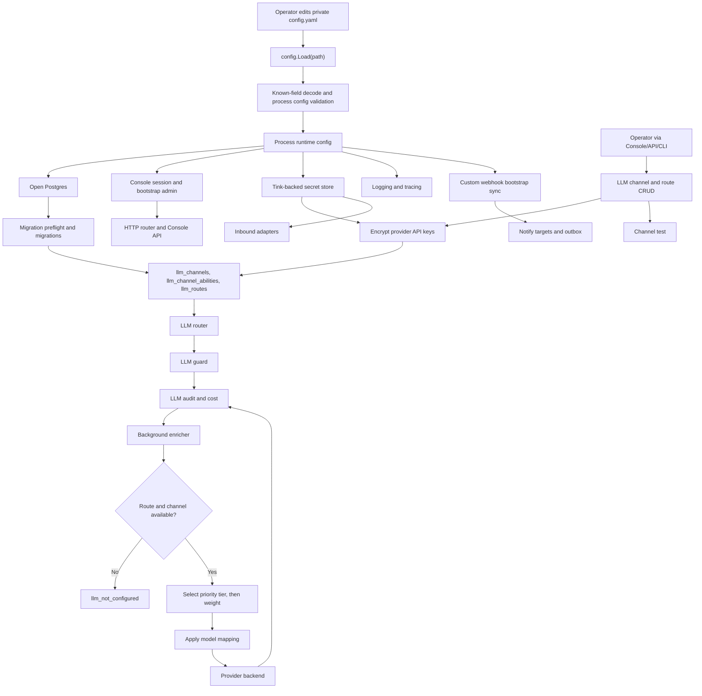
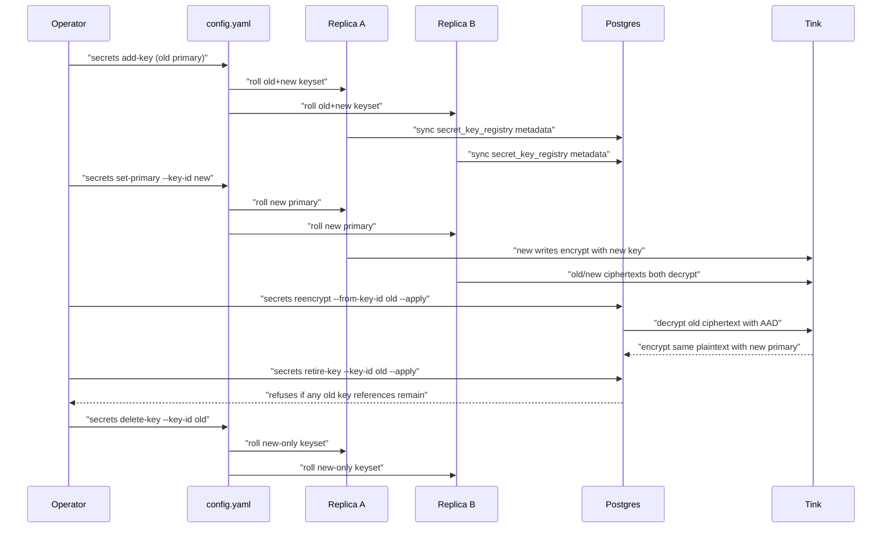

# Config-first runtime and managed LLM channels

| | |
|---|---|
| **Issue** | #23 |
| **Status** | Implemented |
| **Started** | 2026-06-11 10:55 CST |
| **Related** | #7 (private deploy docs), #10 (multi-protocol LLM client), #24 (LLM confidence/cost), #48 (observability/logging), #66 (inbound/bootstrap secrets) |

## Problem

Attune currently has the provider backends needed for #23, but the operator
configuration model is still split and under-modeled:

- `config.Load()` reads `config.yaml` or `FEEDBACK_API_CONFIG`.
- `internal/infra/config/env.go` lets `FEEDBACK_API_*` override YAML.
- Startup-only settings bypass `Config`:
  - `ATTUNE_INBOUND_MASTER_KEY`
  - `ATTUNE_BOOTSTRAP_ADMIN_*`
  - `ATTUNE_CONFIRM_LARK_DELETE`
- Logging and tracing read `ENV`, `APP_VERSION`, and `OTEL_EXPORTER_OTLP_*`
  directly.
- LLM provider configuration is flat and historically named:
  - `llm_protocol`
  - `llm_openai_base_url`
  - `llm_openai_api_key`
  - `llm_model`

The runtime process configuration should be simple and inspectable: one private
YAML file, no env override protocol. But LLM provider state should not be YAML.
Provider channels are live operational resources: operators need to add, test,
disable, rotate keys, change model bindings, and route traffic without editing a
mounted config file and restarting the service.

New API is the useful comparison point. It treats provider connectivity as
channel management: provider type, API key, base URL, supported models, model
mapping, priority, weight, test action, and enabled/disabled state. Attune
should adopt that operational shape with an Attune-sized DB management surface,
not by keeping flat process config or by moving channels into YAML.

## Goals

- Make `config.yaml` the only Attune process configuration source.
- Remove Attune runtime env override paths:
  - `FEEDBACK_API_CONFIG`
  - `FEEDBACK_API_*`
  - `ATTUNE_INBOUND_MASTER_KEY`
  - `ATTUNE_BOOTSTRAP_ADMIN_*`
  - `ATTUNE_CONFIRM_LARK_DELETE`
  - Attune-owned `OTEL_*` reads
- Keep process configuration directly in YAML:
  - database URL
  - console base URL/session key/bootstrap admin
  - shared Tink keyset
  - migration confirmation
  - rate limit
  - logging and observability
  - custom webhook bootstrap, until outbound target CRUD has parity
- Move LLM provider configuration out of YAML into DB-managed resources:
  - channels
  - channel model abilities
  - routes
  - encrypted provider credentials
  - health/test metadata
- Add CRUD for LLM channels and routes through service/repo plus minimum
  Console/API/CLI surfaces.
- Keep local OpenAI-compatible no-auth explicit with `auth_mode: none`.
- Let the server boot without an LLM route/channel so operators can reach the
  Console and configure one. Enrichment should fail with explicit
  `llm_not_configured` until configuration exists.
- Reject old flat keys with known-field decoding instead of keeping a
  compatibility protocol.
- Update Docker Compose, docs, config examples, tests, and changelog in the same
  implementation PR.

## Non-goals

- Do not put `llm.channels`, provider API keys, provider base URLs, or default
  LLM routes in YAML.
- Do not add `*_file` config fields in this proposal.
- Do not build a full New API clone.
- Do not add user-facing API-token resale, quota sales, payment, provider
  balance checks, or model metadata management.
- Do not add multi-key polling in the first PR. The schema should leave room for
  it, but one credential per channel is enough for the first managed surface.
- Do not add background/autonomous key rotation. Secret keyset edits,
  DB-wide re-encryption, and old-key retirement are explicit operator commands.
- Do not add runtime config reload or write-back to YAML.
- Do not remove environment variables used by tests, frontend build tooling, or
  Docker Compose interpolation. Those are not Attune runtime config.

## Decision Record

| Detail | Decision |
|---|---|
| Runtime source of truth | One private YAML file for process config. |
| Config path | Global CLI flag: `attune --config /path/config.yaml ...`; default `./config.yaml`. |
| Config-path env var | Remove `FEEDBACK_API_CONFIG`. |
| App env overrides | Remove all `FEEDBACK_API_*` runtime overrides. |
| Bootstrap env vars | Remove `ATTUNE_INBOUND_MASTER_KEY`, `ATTUNE_BOOTSTRAP_ADMIN_*`, and `ATTUNE_CONFIRM_LARK_DELETE`. |
| Legacy flat YAML | Reject with known-field decoding. No translation layer. |
| Process secret values | Store values directly in the private YAML file. Committed examples use placeholders only. |
| File indirection | Do not add `*_file` config fields in this proposal. |
| LLM provider config | DB-managed channel/ability/route records, not YAML. |
| LLM API key storage | CRUD accepts an API key value, encrypts it with the configured Tink primary key, stores ciphertext with `key_id`, and never returns cleartext. |
| Distributed secret keys | Every replica must have the same decrypt-capable Tink keyset. No per-pod random keys. |
| Local no-auth provider | `auth_mode: none`; no empty key sentinel. |
| LLM startup behavior | Server boots even if no route/channel exists; enrichment returns `llm_not_configured`. |
| LLM management surface | Add service/repo plus Console React UI, Console API, CLI CRUD, channel test operations, and provider model discovery. |
| Secret rotation surface | Add keyset JSON helpers plus DB-wide `reencrypt` and registry `retire-key` commands. |
| Observability | Attune tracing options live in YAML; remove hidden env resource config. |
| Logger format | Always JSON for now; remove `ENV=dev`. |
| Service version | `observability.service_version`; do not export `APP_VERSION` into runtime env. |
| Compose `.env` | Allowed for Compose interpolation such as image tag, bind address, host ports, and Postgres container bootstrap. |
| Tests | Test harness env vars may remain. |
| Changelog | Required; this is a breaking `Changed` / `Removed` entry. |

## Proposal

### Runtime config contract

Attune loads exactly one YAML config file. The path is selected by a global CLI
flag:

```bash
attune --config /etc/attune/config.yaml server
attune --config /etc/attune/config.yaml tenant create --slug demo
attune --config /etc/attune/config.yaml keys issue --tenant demo
attune --config /etc/attune/config.yaml llm channels list
attune --config /etc/attune/config.yaml eval --mode consistency
attune --config /etc/attune/config.yaml outbox prune --older-than 24h
```

If `--config` is omitted, Attune reads `./config.yaml`. If that file is missing,
startup fails. `FEEDBACK_API_CONFIG` is removed.

Command-specific flags remain valid for command behavior (`--tenant`,
`--older-than`, `--sample`, and so on). They do not override runtime config
fields.

### System Flow




The diagram source is rendered with the `pretty-mermaid` workflow and kept in
`docs/proposals/2026/06/assets/2026-06-11-config-first-runtime-flow.mmd`.

### YAML shape

The YAML is intentionally limited to process configuration. It starts the
service, unlocks encrypted DB state, and configures process-level behavior.
LLM channels and routes are not here.

```yaml
port: 8090

database:
  url: "postgres://attune@postgres:5432/attune?sslmode=disable"

enricher:
  interval: "30s"
  batch: 10

console:
  base_url: "https://attune.example.com"
  session_key: "replace-with-at-least-32-random-bytes"
  bootstrap_admin:
    email: "admin@example.com"
    password: "replace-with-a-long-temporary-password"

secrets:
  # Optional migration-only fallback for old inbound AES-GCM envelopes.
  # Remove after `attune secrets reencrypt --apply`.
  legacy_inbound_master_key: ""
  tink_keyset: |
    {
      "primaryKeyId": 123456789,
      "key": [
        {
          "keyData": {
            "typeUrl": "type.googleapis.com/google.crypto.tink.AesGcmKey",
            "value": "replace-with-generated-key-material",
            "keyMaterialType": "SYMMETRIC"
          },
          "status": "ENABLED",
          "keyId": 123456789,
          "outputPrefixType": "TINK"
        }
      ]
    }

migrations:
  confirm_lark_delete: false

rate_limit:
  per_minute: 60
  burst: 300
  disabled: false

observability:
  environment: "prod"
  service_version: "dev"
  otlp_endpoint: ""
  otlp_traces_path: "/opentelemetry/v1/traces"
  otlp_headers: {}
  otlp_insecure: false

custom_webhooks:
  - tenant_slug: "demo"
    audience: "pool"
    url: "https://example.com/attune"
    secret: "replace-with-webhook-secret"
    timeout_seconds: 10
    disabled: false
```

Notes:

- There is no `*_file` convention in the new Attune YAML shape.
- There is no `llm:` block.
- There is no flat `llm_protocol`, `llm_openai_base_url`, `llm_openai_api_key`,
  or `llm_model`.
- `secrets.tink_keyset` is a decrypt-capable Tink AEAD keyset shared by every
  running replica.
- `secrets.legacy_inbound_master_key` is optional and migration-only. It lets
  a new binary read old inbound AES-GCM envelopes long enough to rewrite them
  with Tink, then it should be removed from every replica config.
- Tink's primary key is the key used for new encryption writes.
- Tink ciphertexts carry key id prefixes. LLM credentials also store
  `credential_key_id` next to the DB ciphertext for observability and drift
  detection; startup rejects rows where that metadata disagrees with the
  ciphertext prefix. Inbound source config uses the ciphertext prefix directly.
- The same Tink keyset encrypts DB-managed runtime secrets, including inbound
  source credentials and LLM provider API keys.

### Distributed secret key behavior

Provider API keys and inbound source credentials are persisted in Postgres, but
their Tink keyset lives in process config. That makes distributed semantics
explicit:

- Every server replica must run with the same decrypt-capable Tink keyset.
- A replica must refuse to start if `secrets.tink_keyset` is empty or cannot be
  read as a valid Tink AEAD keyset.
- Startup syncs non-secret local keyset metadata into `secret_key_registry` so
  operators can detect split-brain keyset rollouts.
- Startup rejects an existing `secret_key_registry` row whose `key_id` matches a
  local key but whose fingerprint differs. Same id with different key material
  is a broken deploy, not a rotation.
- Startup also scans encrypted DB references (`llm_channels.credential_ciphertext`,
  `inbound_sources.config`, and nested webhook/email secret ciphertexts inside
  inbound configs) and refuses to run if any referenced key id is missing from
  the local Tink keyset.
- Startup rejects LLM credential rows whose persisted `credential_key_id` does
  not match the key id embedded in the Tink ciphertext prefix.
- New encryptions use Tink's primary key.
- Runtime secret writers take the shared `secret_key_registry` advisory lock
  and verify the selected key is enabled and not retired before persisting new
  ciphertext. This lets inbound source CRUD and LLM credential CRUD share one
  distributed rotation safety path.
- Decryption is delegated to Tink, which uses ciphertext prefixes and enabled
  keys in the local keyset.
- No generated per-pod key is allowed; losing the Tink keyset makes encrypted
  DB credentials unrecoverable.

Rotation is staged for rolling deployments:

1. Add the new key to the Tink keyset while keeping the old primary. Roll this
   config to every replica:
   ```bash
   attune --config ./config.yaml secrets add-key
   ```
2. Change the Tink primary key to the new key and roll again. During the
   rollout, both old-primary and new-primary replicas can decrypt both key ids:
   ```bash
   attune --config ./config.yaml secrets set-primary --key-id <new-key-id>
   ```
3. Rewrite old ciphertexts with the new primary key. The command is a dry run
   unless `--apply` is passed, and it scans both LLM channel credentials and
   inbound source configs, including nested webhook/email secret fields:
   ```bash
   attune --config ./config.yaml secrets reencrypt --from-key-id <old-key-id>
   attune --config ./config.yaml secrets reencrypt --from-key-id <old-key-id> --apply
   ```
4. Retire the old key in `secret_key_registry`. This refuses to apply while any
   DB ciphertext still references the old key:
   ```bash
   attune --config ./config.yaml secrets retire-key --key-id <old-key-id>
   attune --config ./config.yaml secrets retire-key --key-id <old-key-id> --apply
   ```
5. Remove the old key from `secrets.tink_keyset` only after retirement succeeds,
   then roll that config to every replica:
   ```bash
   attune --config ./config.yaml secrets delete-key --key-id <old-key-id>
   ```

### Secret Key Rotation Flow




The diagram source is rendered with the `pretty-mermaid` workflow and kept in
`docs/proposals/2026/06/assets/2026-06-11-secret-key-rotation-flow.mmd`.

The implementation should store non-secret key metadata in the database so
startup can detect config drift:

```sql
CREATE TABLE secret_key_registry (
    key_id              TEXT PRIMARY KEY,
    primary_key         BOOLEAN NOT NULL DEFAULT FALSE,
    status              TEXT NOT NULL DEFAULT 'ENABLED',
    type_url            TEXT NOT NULL DEFAULT '',
    output_prefix_type  TEXT NOT NULL DEFAULT '',
    key_material_type   TEXT NOT NULL DEFAULT '',
    fingerprint_sha256  TEXT NOT NULL DEFAULT '',
    fingerprint_version INTEGER NOT NULL DEFAULT 1,
    first_seen_at       TIMESTAMPTZ NOT NULL DEFAULT now(),
    last_seen_at        TIMESTAMPTZ NOT NULL DEFAULT now(),
    retired_at          TIMESTAMPTZ,
    CHECK (status IN ('ENABLED', 'DISABLED', 'DESTROYED', 'UNKNOWN'))
);
```

`fingerprint` is a stable hash of the raw key used only to detect mismatched
keys with the same `key_id`; the raw key is never stored in the database.

### Unknown-field behavior

The YAML decoder uses known-field validation. Legacy keys fail fast:

- `database_url`
- `llm_protocol`
- `llm_openai_base_url`
- `llm_openai_api_key`
- `llm_model`
- `llm`
- `enricher_interval`
- `enricher_batch`
- `console_session_key`
- `console_base_url`
- `rate_limit_per_minute`
- `rate_limit_burst`
- `rate_limit_disabled`
- any `*_file` replacement for the new inline fields

This is the main break that prevents a long-lived dual protocol. Operators must
update process config files and create LLM channels through the management
surface instead of relying on silent compatibility.

### New API source audit

I checked New API's public docs and source code before choosing the managed LLM
shape. The useful pattern is a provider channel plus a routable model ability:

- `model.Channel` stores provider connection state: provider `Type`, `Name`,
  `Key`, optional `BaseURL`, supported `Models`, `ModelMapping`, `Priority`,
  `Weight`, enabled `Status`, test metadata, auto-disable, tags, and advanced
  overrides.
- `model.Ability` expands channel models/groups into routable rows with
  `Group`, `Model`, `ChannelId`, `Enabled`, `Priority`, `Weight`, and `Tag`.
- The channel cache builds `group -> model -> channel IDs`, skips disabled
  channels, sorts by priority, and uses weighted random selection within the
  chosen priority tier. If all weights are zero, it treats candidates equally.
- Retry moves to the next priority tier.
- Model mapping is applied after channel selection, translating the logical
  requested model to the provider-native upstream model.
- Channel list/read paths omit cleartext keys; key updates are special write
  operations.

Attune copies the useful routing and management boundary, not the whole gateway
product.

Parameter decisions:

| New API concept | Effective in New API? | Attune decision |
|---|---:|---|
| Channel type / provider | Yes. Selects adapter and default URL behavior. | Keep as `protocol`; restrict to existing Attune backends first. |
| Channel id/name | Yes. Operators need labels; audit needs stable identity. | Add stable UUID `id` and mutable `name`. |
| API key | Yes. Required by most providers. | CRUD accepts `api_key`, stores `credential_key_id` + encrypted ciphertext, never returns cleartext. |
| Base URL | Yes. Enables custom OpenAI-compatible gateways and provider overrides. | Keep as `base_url`; required for `openai-compat`, optional otherwise. |
| Supported models | Yes. Drives route eligibility. | Keep through `llm_channel_abilities`. |
| Ability table | Yes. Makes routing queryable/cacheable. | Add `llm_channel_abilities`; no New API billing group in first PR. |
| Priority | Yes. Deterministic failover tier; higher priority wins first. | Keep per ability/model. |
| Weight | Yes. Load distribution within one priority tier. | Keep on channels and abilities. Default `1`; weight `0` removes that candidate from weighted selection unless every candidate is zero. |
| Model mapping | Yes. Logical model can map to provider-native model. | Keep per ability as `provider_model`; default it to the logical model on writes. |
| Enabled/status | Yes. Removes channels from routing without deleting them. | Keep `status` on channels and `enabled` on abilities/routes. |
| Test model / response time | Yes. Admin can test channels and see latency. | Add channel test API/CLI. Persist `last_tested_at`, `last_test_status`, and `last_error`; return latency in the test response. |
| Auto ban / auto-disable | Yes in DB-backed gateways. | Defer. First PR gives explicit `status=disabled|draining` operator control. |
| Multi-key polling/random | Yes. Key rotation and per-channel key pools. | Defer. Single encrypted credential per channel first. |
| Group | Yes. New API uses groups for user/product routing. | Use Attune `llm_routes` with `tenant_id` and `purpose` instead. |
| Tag | Useful for batch ops. | Defer unless Console filtering needs it immediately. |
| Balance / used quota | Useful for gateway billing. | Do not add; Attune already has `llm_audit` cost facts. |
| Param/header override | Powerful gateway escape hatch. | Do not add first. |
| Status-code mapping | Gateway compatibility feature. | Do not add first. |
| Model metadata/pricing | Effective as separate model-management surface. | Do not clone now. Continue existing pricing lookup and audit. |

### Managed LLM schema

Suggested schema:

```sql
CREATE TABLE llm_channels (
    id                    UUID PRIMARY KEY DEFAULT gen_random_uuid(),
    name                  TEXT NOT NULL,
    protocol              TEXT NOT NULL,
    base_url              TEXT NOT NULL DEFAULT '',
    auth_mode             TEXT NOT NULL DEFAULT 'bearer',
    credential_key_id     TEXT NOT NULL DEFAULT '',
    credential_ciphertext BYTEA,
    created_at            TIMESTAMPTZ NOT NULL DEFAULT now(),
    updated_at            TIMESTAMPTZ NOT NULL DEFAULT now(),
    status                TEXT NOT NULL DEFAULT 'enabled',
    priority              INTEGER NOT NULL DEFAULT 0,
    weight                INTEGER NOT NULL DEFAULT 1 CHECK (weight >= 0),
    timeout_seconds       INTEGER NOT NULL DEFAULT 60 CHECK (timeout_seconds > 0),
    last_tested_at        TIMESTAMPTZ,
    last_test_status      TEXT NOT NULL DEFAULT '',
    last_error            TEXT NOT NULL DEFAULT '',
    UNIQUE (name),
    CHECK (protocol IN ('openai-compat', 'openai-responses', 'anthropic', 'gemini')),
    CHECK (auth_mode IN ('bearer', 'none')),
    CHECK (status IN ('enabled', 'disabled', 'draining'))
);

CREATE TABLE llm_channel_abilities (
    id             UUID PRIMARY KEY DEFAULT gen_random_uuid(),
    channel_id     UUID NOT NULL REFERENCES llm_channels(id) ON DELETE CASCADE,
    logical_model  TEXT NOT NULL,
    provider_model TEXT NOT NULL,
    enabled        BOOLEAN NOT NULL DEFAULT TRUE,
    priority       INTEGER NOT NULL DEFAULT 0,
    weight         INTEGER NOT NULL DEFAULT 1 CHECK (weight >= 0),
    created_at     TIMESTAMPTZ NOT NULL DEFAULT now(),
    updated_at     TIMESTAMPTZ NOT NULL DEFAULT now(),
    UNIQUE (channel_id, logical_model),
    CHECK (logical_model <> '')
);

CREATE INDEX idx_llm_abilities_model_enabled
    ON llm_channel_abilities (logical_model, enabled, priority DESC, weight DESC);

CREATE TABLE llm_routes (
    id             UUID PRIMARY KEY DEFAULT gen_random_uuid(),
    tenant_id      TEXT NOT NULL DEFAULT '',
    purpose        TEXT NOT NULL,
    logical_model  TEXT NOT NULL,
    enabled        BOOLEAN NOT NULL DEFAULT TRUE,
    created_at     TIMESTAMPTZ NOT NULL DEFAULT now(),
    updated_at     TIMESTAMPTZ NOT NULL DEFAULT now(),
    UNIQUE (tenant_id, purpose)
);
```

Rules:

- `openai-compat` requires `base_url`.
- `base_url` must be absolute, must not include user info, and may use `http`
  only for localhost/loopback endpoints. Public provider URLs must use `https`.
- SDK-backed protocols may leave `base_url` empty to use vendor defaults.
- `auth_mode = 'bearer'` requires `credential_key_id` and
  `credential_ciphertext`.
- `auth_mode = 'none'` is allowed only for `openai-compat`.
- Channel create/update accepts cleartext `api_key` only on write, encrypts it
  immediately with the current primary key, records `credential_key_id`, and
  drops the cleartext.
- Channel list/get never returns cleartext API keys.
- `llm_channel_abilities.logical_model` is Attune's logical model.
- `llm_channel_abilities.provider_model` is provider-native; empty create/update
  input defaults to the logical model.
- `priority` and `weight` live on ability rows, because one provider may be
  primary for one model and backup for another.
- Empty `tenant_id` on `llm_routes` is the global default; a tenant-specific row
  overrides it for the same purpose. Disabled tenant routes intentionally block
  fallback to the global route, so operators can turn a tenant off explicitly.
- Tenant routes must reference an active tenant regardless of whether the route
  is enabled.

### LLM routing model

Attune calls LLMs for internal purposes. The first purpose is enrichment. A route
maps a tenant/purpose pair to one logical model. Channel eligibility and
priority/weight selection come from DB-backed abilities.

Route resolution:

1. Look for tenant route `(tenant_id, purpose)`.
2. If no tenant route exists, fall back to global route `('', purpose)`.
   A disabled tenant route is still the selected route and returns no
   candidates instead of falling through.
3. Find enabled ability rows for the route's logical model joined to enabled
   channels.
4. Select the highest ability-priority and channel-priority tier.
5. Within that tier, select by `ability.weight * channel.weight`. If total
   weight is zero, select equally.
6. Use `provider_model` as the provider-native model.
7. Record selected channel id, protocol, logical model, and provider model into
   `llm_audit`.

If no route or channel is available, enrichment returns a structured
configuration error. It should not panic or block server startup.

### Console, API, and CLI management

This issue adds a real management surface, not YAML editing.

React Console:

- `/console/llm-config`
- list/create/edit/delete LLM channels
- write-only API key input; empty edit keeps the existing encrypted key
- channel test action with latency/token result
- channel model discovery feeding selectable ability/test provider-model inputs
- selected-channel ability CRUD
- global and tenant route CRUD

Console API:

All LLM configuration endpoints require an authenticated admin Console session.

- `GET /fb/v1/console/llm/channels`
- `POST /fb/v1/console/llm/channels`
- `GET /fb/v1/console/llm/channels/{id}`
- `PATCH /fb/v1/console/llm/channels/{id}`
- `DELETE /fb/v1/console/llm/channels/{id}`
- `POST /fb/v1/console/llm/channels/{id}/test`
- `GET /fb/v1/console/llm/channels/{channel_id}/models`
- `GET /fb/v1/console/llm/channels/{id}/abilities`
- `PUT /fb/v1/console/llm/channels/{id}/abilities`
- `POST /fb/v1/console/llm/channels/{id}/abilities/delete`
- `GET /fb/v1/console/llm/routes`
- `PUT /fb/v1/console/llm/routes`
- `POST /fb/v1/console/llm/routes/delete`

CLI:

- `attune llm channels list|get|create|update|delete|test`
- `attune llm abilities list|upsert|delete`
- `attune llm routes list|upsert|delete`

Secret/keyring CLI:

- `attune secrets generate-keyset`
- `attune secrets keyset-info`
- `attune secrets add-key [--primary]`
- `attune secrets set-primary --key-id <id>`
- `attune secrets reencrypt [--from-key-id <id>] [--apply]`
- `attune secrets retire-key --key-id <id> [--apply]`
- `attune secrets delete-key --key-id <id>`

Create/update accepts `api_key` as a write-only field. Responses include only
metadata such as `has_api_key: true`, never the key.

Example create payload:

```json
{
  "name": "Anthropic primary",
  "protocol": "anthropic",
  "auth_mode": "bearer",
  "api_key": "sk-ant-...",
  "base_url": "",
  "status": "enabled",
  "priority": 100,
  "weight": 1
}
```

Then attach an ability:

```json
{
  "logical_model": "enrich-default",
  "provider_model": "claude-sonnet-4-5",
  "priority": 100,
  "weight": 1,
  "enabled": true
}
```

Example local no-auth payload:

```json
{
  "name": "Local Ollama",
  "protocol": "openai-compat",
  "auth_mode": "none",
  "base_url": "http://host.docker.internal:11434",
  "status": "enabled",
  "priority": 100,
  "weight": 1
}
```

### Internal architecture

The LLM client becomes a routed service backed by repositories instead of a
single provider instance created directly from flat config.

Current:

```text
config -> buildLLMClient(cfg) -> llmguard -> llmaudit -> enricher
```

Target:

```text
config.yaml -> secret store -> llmrouter.Service -> llmguard -> llmaudit -> enricher
                              |
                              +-- llm_channels repo
                              +-- llm_channel_abilities repo
                              +-- llm_routes repo
                              +-- provider factory
```

`llmrouter.Service` implements `llmclient.LLMClient`. For every
`CompletionRequest`, it:

1. Resolves tenant/purpose route to a logical model.
2. Selects an enabled channel ability for that model.
3. Resolves the provider-native model from `provider_model`.
4. Decrypts the selected channel credential using the stable channel AAD for
   the outbound call; skip decrypt for `auth_mode=none`. The stored
   `credential_key_id` is observability metadata and must match the Tink
   ciphertext prefix before startup succeeds.
5. Builds the concrete provider backend.
6. Calls the provider with the provider-native model.
7. Returns the normalized `CompletionResponse` with route metadata.

`llmclient.CompletionResponse` should grow optional route metadata so the
existing `llmaudit` wrapper can record what the router actually selected:

```go
type RouteMetadata struct {
    ChannelID     string
    Protocol      string
    LogicalModel  string
    ProviderModel string
}
```

The implementation should extend `llm_audit` with nullable `channel_id`,
`protocol`, and `provider_model_id` columns. Existing `model_id` remains the
requested/logical model for query continuity. Cost lookup should prefer
`provider_model_id` when present, falling back to `model_id`.

The existing provider backends remain small and focused:

- `openai-compat`
- `openai-responses`
- `anthropic`
- `gemini`

### Startup wiring changes

The server path becomes:

1. Install the default JSON logger.
2. Parse global CLI options and subcommand.
3. Load process config from the explicit/default config path.
4. Initialize tracing from `observability`.
5. Open database using `database.url`.
6. Run destructive migration preflight using `migrations.confirm_lark_delete`.
7. Run migrations.
8. Decode `secrets.tink_keyset`, create the Tink-backed secret store, sync
   non-secret key metadata, validate encrypted DB key references, and reject
   mismatched LLM credential key-id metadata.
9. Build LLM router from DB repositories, secret store, and provider factories.
10. Sync configured `custom_webhooks` into `tenant_notify_targets`.
11. Bootstrap first admin from `console.bootstrap_admin` if admins are empty.
12. Start inbound adapters and background enrichment.

Specific function changes:

- `config.Load()` reads the global config path; `config.LoadPath(path)` exists
  for tests and tools.
- `internal/infra/config/env.go` is deleted.
- `internal/infra/config/bootstrap_env.go` is deleted.
- `inbound.BootstrapValidate()` is removed; inbound uses the shared Tink store.
- `console.BootstrapAdmin(ctx, repo)` becomes
  `console.BootstrapAdmin(ctx, repo, cfg.Console.BootstrapAdmin)`.
- `database.ConfirmLarkDelete(ctx, pool)` becomes
  `database.ConfirmLarkDelete(ctx, pool, cfg.Migrations.ConfirmLarkDelete)`.
- `buildLLMClient(cfg)` is replaced by provider factories used by the router.
- `setupTracing(ctx)` becomes `setupTracing(ctx, cfg)`.
- `observability.BuildDefaultHandler` stops reading `ENV` and always builds the
  JSON handler.

### Docker and Compose

The image no longer sets `FEEDBACK_API_CONFIG`. The entrypoint stays
`/app/attune`; the image `CMD` supplies the default config path:

```yaml
services:
  attune:
    image: ${ATTUNE_IMAGE:-ghcr.io/phixsura/attune:latest}
    volumes:
      - ./config.yaml:/app/config.yaml:ro
```

Compose `.env` may still be used for Compose-owned interpolation such as image
tag, host bind address, host ports, and Postgres container bootstrap:

- `ATTUNE_IMAGE`
- `ATTUNE_BIND`
- `ATTUNE_PORT`
- `POSTGRES_USER`
- `POSTGRES_PASSWORD`
- `POSTGRES_DB`
- `PROMETHEUS_PORT`
- `GRAFANA_PORT`

Those values are Docker Compose inputs. Attune process settings live in
`config.yaml`. LLM provider settings live in the database.

### Observability and logging

Attune-owned observability settings move into YAML. Logs are JSON by default:

```yaml
observability:
  environment: "prod"
  service_version: ""
  otlp_endpoint: "otel-collector:4318"
  otlp_traces_path: "/opentelemetry/v1/traces"
  otlp_headers:
    x-api-key: "example"
  otlp_insecure: true
```

`service_version` defaults to `dev` when omitted. Attune-owned tracing options
no longer read `OTEL_EXPORTER_OTLP_*`, and the OTel resource is built from YAML
plus process/SDK attributes rather than environment resource extension.

### Documentation contract

The docs should state two rules consistently:

> Attune process config is one private YAML file. Environment variables are not
> part of Attune's runtime config contract.

> LLM providers and routes are managed runtime resources persisted in Attune's
> database. Add, test, disable, rotate, and route them through Console/API/CLI.

> Runtime secret keys are a shared Tink keyring in YAML; encrypted DB secrets are
> re-encrypted and retired with explicit `attune secrets ...` commands.

The following documents need updates in the implementation PR:

- `AGENTS.md` / `CLAUDE.md` security baseline language
- `README.md`
- `config.example.yaml`
- `deploy/config.yaml`
- `deploy/.env.example`
- `deploy/README.md`
- `docs/private-deploy.md`
- `docs/testing.md` where it describes live/integration test-only env vars
- `docs/observability-trace-design.md`
- Console login hint copy

## Alternatives Considered

### Keep flat YAML and env overrides

Rejected. This keeps two process-config protocols alive indefinitely and keeps
the historical `llm_openai_*` naming confusion.

### Put LLM channels in YAML

Rejected. Provider channels are runtime-operational state. YAML would force
restart/edit cycles for key rotation, disabling a bad provider, health tests,
model changes, and route changes.

### Use `*_file` fields for secrets

Rejected for this proposal. It adds another config indirection while this issue
is already breaking the contract. The chosen contract is: private YAML for
process config; encrypted DB records for runtime provider credentials.

### Use empty API key to represent local no-auth

Rejected. This is an unnatural encoding of a provider auth policy. The correct
model is explicit channel auth: `auth_mode: none`.

### Clone New API's full channel system

Rejected. New API is a gateway and AI asset management system; Attune is a
product-intelligence service that needs reliable internal LLM routing. We copy
the useful routing and channel management boundary, not the whole product.

### Keep OTel env vars because the ecosystem supports them

Rejected for Attune runtime configuration. OpenTelemetry environment variables
are common, but this project is choosing a config-first operational contract.
Tracing options should be visible in the same file as the rest of the service.

## Risks / Tradeoffs

- This is a breaking change. Existing deploys using `.env` or flat YAML will
  fail until they migrate.
- DB-managed LLM channels are larger than a config loader refactor. This touches
  migrations, repos, services, handlers/CLI, router wiring, audit, and tests.
- Provider credentials become unrecoverable if the configured Tink keyset is lost.
  Operators must back it up with database credentials.
- A bad rolling deploy can create a split-brain Tink keyset if one replica writes
  with a key id that another live replica cannot decrypt. The staged rotation
  process and startup metadata checks are mandatory.
- Key rotation is intentionally explicit, not automatic. Operators must roll the
  old+new keyset to every replica, dry-run `reencrypt`, apply it, dry-run
  `retire-key`, apply it, and only then remove the old key from YAML.
- The server can boot without an enabled LLM route/channel. That improves setup
  flow but means enrichment errors become operational state until configured.
- First PR does not implement multi-key pools or automatic model sync.
- Logger configuration now uses JSON by default before config loading.
- Release telemetry can set `observability.service_version` in YAML.
- OTel operators used to `OTEL_*` need a migration note.
- Tests and CI still need environment variables for test harnesses. The docs
  must distinguish test-only inputs from runtime config.

## Implementation Plan

1. Update this proposal and #23 with the final process-YAML plus DB-managed LLM
   direction.
2. Refactor process config:
   - nested YAML structs
   - known-field decoding
   - no env overrides
   - no `*_file` indirection
   - no `llm` block
3. Add global CLI config-path parsing:
   - `attune --config <path> ...`
   - default `config.yaml`
4. Generalize encrypted secret storage:
   - `secrets.tink_keyset`
   - Tink AEAD ciphertext prefixes with key ids
   - `secret_key_registry` metadata checks
   - reusable Tink-backed store for inbound source secrets and LLM provider
     credentials
   - keyset JSON helper commands for adding keys, changing primary, inspecting
     metadata, and deleting retired local keys
5. Add DB-wide secret rotation:
   - row-locking re-encryption repository
   - LLM credential rewrite with stable AAD
   - inbound source outer envelope rewrite
   - nested webhook current/previous secret rewrite
   - nested email password rewrite
   - dry-run/apply reports
   - old-key retirement refusal while references remain
6. Add LLM schema/repositories:
   - `llm_channels`
   - `llm_channel_abilities`
   - `llm_routes`
   - `llm_audit` channel/protocol/provider model columns
7. Add LLM service layer:
   - channel CRUD
   - credential encrypt/update semantics with `key_id`
   - route CRUD
   - channel test
   - validation
8. Add LLM router service:
   - route resolution
   - DB-backed channel selection
   - model mapping through `provider_model`
   - credential decrypt by selected channel `credential_key_id`
   - provider factory invocation
   - structured `llm_not_configured` error
9. Replace `buildLLMClient(cfg)` wiring with the router.
10. Add management surfaces:
    - Console React UI for channel/ability/route CRUD and channel test
    - Console/API CRUD/test endpoints
    - CLI channel/ability/route CRUD plus channel test commands
    - CLI secret keyset/rotation/retirement commands
11. Move logging and tracing configuration into YAML:
    - remove `ENV=dev`
    - remove Attune-managed `OTEL_*` reads
    - read service version from YAML
12. Update Dockerfile and Compose:
    - remove `FEEDBACK_API_CONFIG`
    - build and copy the Console SPA into the runtime image so `/console/*`
      works in the published image
    - mount config file
    - keep `.env` only for Compose interpolation
13. Update docs and examples listed above.
14. Add changelog entry under `[Unreleased]` with breaking-change notes.

## Verification

Focused unit tests:

- `config.Load(path)` loads the nested process YAML shape.
- Missing config file fails.
- Legacy flat keys fail known-field validation.
- New `*_file` keys fail known-field validation.
- Any `llm:` block in YAML fails known-field validation.
- `FEEDBACK_API_*` / `ATTUNE_*` env vars do not override config values.
- Tink keyset decoder rejects empty or invalid keysets.
- Secret-key metadata sync records Tink key ids, status, primary flag, and
  fingerprints in `secret_key_registry`.
- Startup key validation rejects:
  - LLM credential `credential_key_id` values that disagree with the ciphertext
    prefix
  - LLM credentials, inbound outer configs, and nested webhook/email
    ciphertexts that reference a key id missing from the local Tink keyset
- Secret keyset helpers:
  - `generate-keyset` creates a valid Tink keyset
  - `add-key` preserves the old primary unless `--primary` is passed
  - `set-primary` changes the primary to an enabled existing key
  - `delete-key` refuses to delete the primary
- DB-wide secret rotation:
  - dry-run reports old-key LLM and inbound references without writing rows
  - apply rewrites LLM credentials with stable channel AAD
  - apply rewrites inbound outer configs and nested webhook/email secrets
  - rotation refuses rows whose stored LLM key id disagrees with the ciphertext
    prefix
  - `retire-key --apply` refuses while old-key references remain
  - `retire-key --apply` disables registry metadata after re-encryption
- Bootstrap admin validates password length from config.
- Stale admin sessions created before the first tenant exists are re-scoped to
  the first active tenant on each authenticated Console request without
  bypassing dispatcher-owned response emission.
- `ConfirmLarkDelete(ctx, pool, true)` bypasses DB checks; `false` preserves the
  guard.
- Observability options are built from config, not env.
- LLM channel validation:
  - protocols accepted: `openai-compat`, `openai-responses`, `anthropic`,
    `gemini`
  - `openai-compat` requires `base_url`
  - `auth_mode=none` allowed only for `openai-compat`
  - public `http://` base URLs are rejected; `http://localhost` and loopback
    development providers remain allowed
  - `auth_mode=bearer` requires an encrypted credential and key id
  - create/update accepts cleartext `api_key` and stores only key id plus
    ciphertext
  - update without an `api_key` does not rewrite or clear the existing encrypted
    credential
  - list/get never returns cleartext API keys
  - model names cannot be empty
  - route models must have at least one eligible enabled ability
  - tenant routes require an active tenant even when disabled
  - channel test persists sanitized provider errors instead of raw upstream
    payloads
- LLM router:
  - no route returns `llm_not_configured`
  - no enabled channel returns `llm_not_configured`
  - tenant route overrides global route
  - disabled tenant route blocks global fallback
  - highest priority is selected first
  - weighted selection stays inside the top priority tier
  - all-zero weights still select a top-tier candidate
  - `provider_model` is applied before provider call
  - provider credential is decrypted only for selected channel using its key id
  - `auth_mode=none` sends no authorization credential
  - response route metadata records channel/protocol/logical/provider model
  - `llm_audit` writes channel/protocol/provider model without leaking secrets
- API/CLI:
  - channel create/update/delete/list/get
  - ability upsert/delete/list
  - route upsert/delete/list
  - channel test reports success/failure without leaking API keys
  - channel model discovery uses the stored channel credential and never returns
    API-key material
- Console API:
  - LLM config routes require admin sessions and reject non-admin Console users
- Console UI:
  - `/llm-config` is linked from the authenticated top nav
  - channel table shows protocol/auth/status without cleartext keys
  - create/edit channel dialog keeps existing keys on empty edit
  - ability/test dialogs expose provider model candidates when discovery
    succeeds, while preserving manual entry
  - ability and route tables share logical model names intentionally
  - MSW-backed page test renders channels, abilities, and routes
- Enrichment repository:
  - failed rows schedule exponential retry backoff
  - rows are not claimable before `enrichment_next_retry_at`
  - rows stop retrying after the max-attempt cap
  - persistence failures mark the row failed instead of leaving it stuck in
    `enriching`
- Real browser E2E:
  - start Postgres, backend, and Vite with a private YAML config and local
    proxy-enabled backend environment
  - create a tenant via `attune tenant create`
  - configure an encrypted OpenAI-compatible LLM channel, ability, and route
  - issue an external API key via `attune keys issue`
  - POST a unique marker to `/v1/feedback/ingest` with `X-API-Key`
  - wait for enrichment to move from `pending`/retryable provider failures to
    `done`
  - verify in the browser that `/feedback` shows the marker, title, dimensions,
    confidence, language, source, source metadata, and enriched timestamp

Command/deploy checks:

- `go test ./internal/infra/config ./internal/inbound ./internal/handlers/console/auth ./internal/infra/database ./internal/infra/llmclient ./internal/service/enrich`
- `go test ./internal/service/llmrouter ./internal/service/llmconfig ./internal/repo/llmconfig ./internal/infra/secretstore ./internal/service/secretrotation ./internal/repo/secretrotation ./cmd/attune`
- `go test -tags=integration -count=1 ./test/integration/postgres/secretrotation`
- `go test -tags=integration -count=1 ./test/integration/postgres/llmconfig ./test/integration/postgres/feedback`
- `pnpm tsc -b --noEmit`
- `pnpm biome check`
- `pnpm vitest run --coverage`
- `pnpm exec vite build`
- `pnpm arch`
- `go vet ./...`
- `go build ./...`
- `docker compose -f deploy/docker-compose.yml config -q`
- `docker compose -f deploy/docker-compose.yml -f deploy/docker-compose.obs.yml config -q`

Full gates before merge:

- `go test -race ./...`
- `go mod tidy && git diff --exit-code go.mod go.sum`
- `scripts/lint-slog.sh --strict`
- `scripts/lint-rawptr.sh`
- `scripts/lint-errorcode.sh`
- `scripts/lint-integration-layout.sh`

## Migration Guide

Old flat YAML:

```yaml
database_url: "postgres://attune@postgres:5432/attune?sslmode=disable"
llm_protocol: "anthropic"
llm_openai_api_key: "sk-ant-..."
llm_model: "claude-sonnet-4-5"
console_session_key: "..."
rate_limit_per_minute: 60
```

New process YAML:

```yaml
database:
  url: "postgres://attune@postgres:5432/attune?sslmode=disable"

console:
  base_url: "https://attune.example.com"
  session_key: "replace-with-random-session-key"
  bootstrap_admin:
    email: "admin@example.com"
    password: "replace-with-temporary-password"

secrets:
  # Optional migration-only fallback for old inbound AES-GCM envelopes.
  legacy_inbound_master_key: ""
  tink_keyset: |
    {
      "primaryKeyId": 123456789,
      "key": []
    }

rate_limit:
  per_minute: 60
  burst: 300
  disabled: false
```

Then create provider channels and route through Console/API/CLI:

```bash
attune --config ./config.yaml llm channels create \
  --name "Anthropic primary" \
  --protocol anthropic \
  --auth-mode bearer \
  --api-key sk-ant-... \
  --priority 100

attune --config ./config.yaml llm channels test \
  --id <channel-id> \
  --provider-model claude-sonnet-4-5

attune --config ./config.yaml llm abilities upsert \
  --channel <channel-id> \
  --logical-model enrich-default \
  --provider-model claude-sonnet-4-5 \
  --priority 100

attune --config ./config.yaml llm routes upsert \
  --purpose enrich \
  --logical-model enrich-default
```

For local no-auth:

```bash
attune --config ./config.yaml llm channels create \
  --name "Local Ollama" \
  --protocol openai-compat \
  --auth-mode none \
  --base-url http://host.docker.internal:11434 \
  --priority 100

attune --config ./config.yaml llm channels test \
  --id <channel-id> \
  --provider-model llama3.1

attune --config ./config.yaml llm abilities upsert \
  --channel <channel-id> \
  --logical-model enrich-default \
  --provider-model llama3.1 \
  --priority 100

attune --config ./config.yaml llm routes upsert \
  --purpose enrich \
  --logical-model enrich-default
```

For distributed Tink key rotation after the system is running:

```bash
# Inspect current key ids without printing key material.
attune --config ./config.yaml secrets keyset-info

# Print a new old+new keyset JSON. Paste it into secrets.tink_keyset and roll it
# to every replica while the old key remains primary.
attune --config ./config.yaml secrets add-key

# After every replica has old+new, make the new key primary, paste the output
# into secrets.tink_keyset, and roll every replica again.
attune --config ./config.yaml secrets set-primary --key-id <new-key-id>

# Rewrite old ciphertexts, then mark the old registry row retired.
attune --config ./config.yaml secrets reencrypt --from-key-id <old-key-id>
attune --config ./config.yaml secrets reencrypt --from-key-id <old-key-id> --apply
attune --config ./config.yaml secrets retire-key --key-id <old-key-id>
attune --config ./config.yaml secrets retire-key --key-id <old-key-id> --apply

# After retirement succeeds, print a new keyset JSON without the old key, paste
# it into secrets.tink_keyset, and roll every replica one final time.
attune --config ./config.yaml secrets delete-key --key-id <old-key-id>
```

## References

- New API Channel Management:
  <https://docs.newapi.pro/en/docs/guide/feature-guide/admin/channel>
- New API Model Management:
  <https://docs.newapi.pro/en/docs/guide/feature-guide/admin/model>
- New API project overview:
  <https://github.com/QuantumNous/new-api>
- New API environment variable guide:
  <https://docs.newapi.pro/en/docs/installation/config-maintenance/environment-variables>
- New API channel source:
  <https://github.com/QuantumNous/new-api/blob/main/model/channel.go>
- New API ability/routing source:
  <https://github.com/QuantumNous/new-api/blob/main/model/ability.go>
- New API channel cache source:
  <https://github.com/QuantumNous/new-api/blob/main/model/channel_cache.go>
- New API channel selection source:
  <https://github.com/QuantumNous/new-api/blob/main/service/channel_select.go>
- New API model mapping source:
  <https://github.com/QuantumNous/new-api/blob/main/relay/helper/model_mapped.go>
- New API model metadata source:
  <https://github.com/QuantumNous/new-api/blob/main/model/model_meta.go>
- Docker Compose environment interpolation:
  <https://docs.docker.com/compose/environment-variables/>
- OpenTelemetry SDK resource configuration:
  <https://opentelemetry.io/docs/specs/otel/resource/sdk/>
- Prometheus configuration file:
  <https://prometheus.io/docs/prometheus/latest/configuration/configuration/>
