# Cluster duplicate feedback via embedding similarity

| | |
|---|---|
| **Issue** | #25 |
| **Status** | Implemented |
| **Started** | 2026-06-12 23:00 CST |
| **Related** | #23 (config-first runtime), #24 (LLM confidence/cost), #109 (managed LLM channels) |

## Problem

When 100 users report "checkout button doesn't work", they become 100 independent
feedback rows today. Operators see 100 separate items instead of 3 clusters ×
~15 reports each. Manual deduplication is unsustainable at scale.

The current enrichment pipeline classifies each feedback independently:

```
Ingest → Triage → LLM Classification → Persist → Dispatch
```

There is no semantic similarity signal. Two feedbacks with identical meaning but
different wording are stored and displayed as unrelated items.

Automatic clustering via embedding similarity reduces operator cognitive load by
an order of magnitude. Instead of scanning 100 rows, operators review 7 cluster
summaries.

## Goals

- Compute a content embedding for each feedback after LLM classification.
- Store embeddings in `user_feedback.embedding VECTOR(256)` using pgvector
  (Matryoshka dimension reduction for 6x storage savings).
- Cluster semantically similar feedback within the same tenant and a 30-day
  recency window.
- Use cosine similarity threshold (default 0.75, see Golden Corpus Test results) to determine cluster membership.
- Assign `cluster_id UUID` to each feedback row:
  - Found similar → inherit `cluster_id` from nearest neighbor
  - Not found → assign new UUID
- Generate LLM-based cluster labels when cluster reaches 3+ members.
- Add `GET /fb/v1/console/clusters` endpoint returning cluster summaries.
- Update Console list view to group by `cluster_id` with expand/collapse.
- Provide backfill worker for existing feedback and model upgrades.
- Document pgvector dependency in README and private-deploy docs.
- Gracefully refuse startup if pgvector extension is unavailable.

## Non-goals

- Do not implement real-time streaming clustering or incremental updates.
- Do not add user-facing cluster management (merge, split, rename) in this PR.
- Do not replace LLM classification with embedding-only approaches.
- Do not add cross-tenant similarity search.
- Do not add embedding-based search/retrieval for arbitrary queries.
- Do not implement hierarchical clustering (parent_cluster_id) in this PR.

## Decision Record

| Detail | Decision |
|---|---|
| Embedding model | Configurable via `llm_routes` (`purpose='embed'`) → `llm_abilities` → `provider_model`. Default: `text-embedding-3-small`. |
| Embedding dimensions | 256 dims via Matryoshka (`dimensions` param). 6x storage savings, ~95% quality retention. |
| Embedding storage | `VECTOR(256)` column via pgvector extension |
| Similarity metric | Cosine similarity (`<=>` operator) |
| Similarity threshold | 0.75 default (configurable per tenant via `tenant_config.clustering_threshold`) |
| Clustering scope | Same tenant, same embedding model, last 30 days |
| Cluster assignment | Nearest-neighbor with threshold; new UUID if no match |
| Cluster labeling | LLM-generated 5-word summary when cluster reaches 3+ members |
| Index type | HNSW with `m=24, ef_construction=100` for production scale |
| Integration point | **Outbox pattern** (not fire-and-forget goroutine) via `embedding_task` table |
| Embedding client | New `EmbeddingClient` interface, parallel to `LLMClient` |
| Routing | Reuse `llm_routes` with `purpose='embed'`; share channels |
| Failure mode | Retry with exponential backoff; does not block enrichment |
| Backfill | Dedicated worker with rate limiting (~100/sec) |
| Feature flag | Per-tenant `clustering_enabled` for rollback |
| Console endpoint | `GET /fb/v1/console/clusters` returns cluster list with stats |

## Proposal

### System Flow




The diagram sources are rendered with the `pretty-mermaid` workflow and kept in
`docs/proposals/2026/06/assets/`.

**Key change from initial design**: Instead of fire-and-forget goroutines, we use
an **outbox pattern** with `embedding_task` table. This provides:
- Backpressure control
- Retry with exponential backoff
- Trace context preservation
- Queue depth monitoring

### Database Schema

Migration `025_pgvector_embeddings.sql`:

```sql
-- Embedding support for semantic clustering (#25).
--
-- pgvector stores dense embeddings as a fixed-length vector type.
-- Each feedback row can carry an embedding of its content for similarity search.
--
-- Requires pgvector >= 0.5.0 for HNSW index support.

-- Enable pgvector extension (idempotent)
-- NOTE: Requires rds_superuser on RDS. Grant with:
--   GRANT rds_superuser TO attune_user;
CREATE EXTENSION IF NOT EXISTS vector;

-- Verify pgvector version (HNSW requires >= 0.5.0)
DO $$
BEGIN
  IF NOT EXISTS (
    SELECT 1 FROM pg_extension 
    WHERE extname = 'vector' 
    AND string_to_array(extversion, '.')::int[] >= ARRAY[0,5,0]
  ) THEN
    RAISE EXCEPTION 'pgvector >= 0.5.0 required for HNSW indexes';
  END IF;
END $$;

-- Add embedding and clustering columns to user_feedback
ALTER TABLE user_feedback
    ADD COLUMN IF NOT EXISTS embedding vector(256),
    ADD COLUMN IF NOT EXISTS embedding_model TEXT NOT NULL DEFAULT '',
    ADD COLUMN IF NOT EXISTS embedding_dims INT,
    ADD COLUMN IF NOT EXISTS embedded_at TIMESTAMPTZ,
    ADD COLUMN IF NOT EXISTS cluster_id UUID,
    ADD COLUMN IF NOT EXISTS cluster_label TEXT,
    ADD COLUMN IF NOT EXISTS cluster_assigned_at TIMESTAMPTZ;

-- Embedding task queue (outbox pattern)
CREATE TABLE IF NOT EXISTS embedding_task (
    id BIGSERIAL PRIMARY KEY,
    feedback_id BIGINT NOT NULL REFERENCES user_feedback(id) ON DELETE CASCADE,
    tenant_id TEXT NOT NULL,
    status TEXT NOT NULL DEFAULT 'pending'
        CHECK (status IN ('pending', 'running', 'done', 'failed')),
    attempts INT NOT NULL DEFAULT 0,
    next_retry_at TIMESTAMPTZ,
    error_message TEXT,
    created_at TIMESTAMPTZ NOT NULL DEFAULT NOW(),
    updated_at TIMESTAMPTZ NOT NULL DEFAULT NOW(),
    UNIQUE (feedback_id)
);

CREATE INDEX IF NOT EXISTS idx_embedding_task_pending
    ON embedding_task (next_retry_at, created_at)
    WHERE status IN ('pending', 'failed') AND (next_retry_at IS NULL OR next_retry_at <= NOW());

-- HNSW index for fast approximate nearest neighbor search
-- Parameters tuned for 100k+ rows: m=24 gives ~5% better recall than default m=16
CREATE INDEX IF NOT EXISTS idx_user_feedback_embedding_hnsw
    ON user_feedback
    USING hnsw (embedding vector_cosine_ops)
    WITH (m = 24, ef_construction = 100)
    WHERE embedding IS NOT NULL;

-- Index for cluster queries (with tenant isolation)
CREATE INDEX IF NOT EXISTS idx_user_feedback_cluster
    ON user_feedback (tenant_id, cluster_id, created_at DESC)
    WHERE cluster_id IS NOT NULL;

-- Index for pending embedding backfill
CREATE INDEX IF NOT EXISTS idx_user_feedback_pending_embed
    ON user_feedback (tenant_id, created_at)
    WHERE enrichment_status = 'enriched' AND embedding IS NULL;

-- Add clustering feature flag to tenant config
ALTER TABLE tenants
    ADD COLUMN IF NOT EXISTS clustering_enabled BOOLEAN NOT NULL DEFAULT TRUE,
    ADD COLUMN IF NOT EXISTS clustering_threshold FLOAT NOT NULL DEFAULT 0.85
        CHECK (clustering_threshold >= 0.5 AND clustering_threshold <= 1.0);
```

Rollback migration `025_pgvector_embeddings_down.sql`:

```sql
-- Rollback: remove embedding columns and tables
DROP INDEX IF EXISTS idx_user_feedback_embedding_hnsw;
DROP INDEX IF EXISTS idx_user_feedback_cluster;
DROP INDEX IF EXISTS idx_user_feedback_pending_embed;
DROP INDEX IF EXISTS idx_embedding_task_pending;
DROP TABLE IF EXISTS embedding_task;

ALTER TABLE user_feedback
    DROP COLUMN IF EXISTS embedding,
    DROP COLUMN IF EXISTS embedding_model,
    DROP COLUMN IF EXISTS embedding_dims,
    DROP COLUMN IF EXISTS embedded_at,
    DROP COLUMN IF EXISTS cluster_id,
    DROP COLUMN IF EXISTS cluster_label,
    DROP COLUMN IF EXISTS cluster_assigned_at;

ALTER TABLE tenants
    DROP COLUMN IF EXISTS clustering_enabled,
    DROP COLUMN IF EXISTS clustering_threshold;

-- Note: DROP EXTENSION vector; -- only if no other tables use it
```

### EmbeddingClient Interface

New file `internal/infra/llmclient/embedding.go`:

```go
// EmbeddingClient generates vector embeddings for text content.
// Implementations are provider-specific (OpenAI, Gemini, etc.).
type EmbeddingClient interface {
    // Embed generates embeddings for the given texts.
    // Returns one vector per input text, in the same order.
    Embed(ctx context.Context, req EmbeddingRequest) (EmbeddingResponse, error)

    // Close releases any resources held by the client.
    Close() error
}

type EmbeddingRequest struct {
    Model      string   // provider-native model ID (resolved by router)
    Input      []string // texts to embed (batch up to 2048 for OpenAI)
    Dimensions int      // optional: Matryoshka dimension reduction (256, 512, 1536)
    UserID     string   // audit trail
}

type EmbeddingResponse struct {
    Embeddings [][]float32   // one vector per input
    Usage      Usage         // token counts
    Route      RouteMetadata // audit trail (channel, model)
}
```

### Embedding Router

New file `internal/service/llmrouter/embedding_router.go`:

```go
// EmbeddingRouter wraps EmbeddingClient with DB-managed routing.
type EmbeddingRouter struct {
    repo    *llmconfigrepo.Repo
    secrets secretstore.Store
    factory embeddingFactory
}

func (r *EmbeddingRouter) Embed(ctx context.Context, tenantID, purpose string, input []string) (llmclient.EmbeddingResponse, error) {
    // 1. Resolve route for purpose='embed'
    candidates, err := r.repo.ResolveCandidates(ctx, tenantID, purpose)
    if err != nil {
        return llmclient.EmbeddingResponse{}, fmt.Errorf("resolve candidates: %w", err)
    }
    if len(candidates) == 0 {
        return llmclient.EmbeddingResponse{}, ErrNotConfigured
    }

    // 2. Select channel by priority/weight (same logic as LLM router)
    for _, candidate := range candidateAttempts(candidates) {
        // 3. Decrypt credential
        apiKey, err := r.secrets.DecryptValue(ctx, candidate.Channel.CredentialKeyID, 
            candidate.Channel.CredentialCiphertext, embedChannelAAD(candidate.Channel.ID))
        if err != nil {
            continue // try next candidate
        }

        // 4. Build provider backend
        client, err := r.factory(candidate.Channel.Protocol, candidate.Channel.BaseURL, apiKey)
        if err != nil {
            continue
        }
        defer client.Close()

        // 5. Call Embed with Matryoshka dimension reduction
        resp, err := client.Embed(ctx, llmclient.EmbeddingRequest{
            Model:      candidate.Ability.ProviderModel,
            Input:      input,
            Dimensions: 256, // Matryoshka: 6x storage savings, ~95% quality
        })
        if err != nil {
            continue // failover to next candidate
        }

        // 6. Populate RouteMetadata
        resp.Route = llmclient.RouteMetadata{
            ChannelID:     candidate.Channel.ID.String(),
            ChannelName:   candidate.Channel.Name,
            Protocol:      candidate.Channel.Protocol,
            LogicalModel:  candidate.Ability.LogicalModel,
            ProviderModel: candidate.Ability.ProviderModel,
        }
        return resp, nil
    }
    return llmclient.EmbeddingResponse{}, ErrAllCandidatesFailed
}
```

### Embedding Worker (Outbox Pattern)

New file `internal/service/enrich/embedding_worker.go`:

```go
// EmbeddingWorker processes embedding tasks from the outbox queue.
// Uses the same poll/claim pattern as the enricher.
type EmbeddingWorker struct {
    taskRepo    *embeddingrepo.TaskRepo
    feedbackRepo *feedback.FeedbackRepo
    embedRouter *llmrouter.EmbeddingRouter
    tenantRepo  *tenant.TenantRepo
    
    batchSize   int           // default 10
    pollInterval time.Duration // default 5s
    maxAttempts int           // default 5
}

func (w *EmbeddingWorker) Run(ctx context.Context) {
    ticker := time.NewTicker(w.pollInterval)
    defer ticker.Stop()
    
    for {
        select {
        case <-ctx.Done():
            return
        case <-ticker.C:
            w.processBatch(ctx)
        }
    }
}

func (w *EmbeddingWorker) processBatch(ctx context.Context) {
    const where = "service.EmbeddingWorker.processBatch"
    
    // 1. Claim pending tasks
    tasks, err := w.taskRepo.ClaimBatch(ctx, w.batchSize)
    if err != nil {
        logext.Warnf(ctx, "[%s] claim batch failed: %+v", where, err)
        return
    }
    if len(tasks) == 0 {
        return
    }
    
    // 2. Group by tenant for batch embedding (amortize API overhead)
    byTenant := groupTasksByTenant(tasks)
    
    for tenantID, tenantTasks := range byTenant {
        // Check feature flag
        cfg, err := w.tenantRepo.GetConfig(ctx, tenantID)
        if err != nil || !cfg.ClusteringEnabled {
            w.taskRepo.MarkSkipped(ctx, tenantTasks)
            continue
        }
        
        // 3. Batch embed (up to 100 items per API call)
        contents := extractContents(tenantTasks)
        resp, err := w.embedRouter.Embed(ctx, tenantID, "embed", contents)
        if err != nil {
            w.handleBatchFailure(ctx, tenantTasks, err)
            continue
        }
        
        // 4. Process each embedding
        for i, task := range tenantTasks {
            if i >= len(resp.Embeddings) {
                break
            }
            w.processOne(ctx, task, resp.Embeddings[i], resp.Route.ProviderModel, cfg.ClusteringThreshold)
        }
    }
}

func (w *EmbeddingWorker) processOne(ctx context.Context, task EmbeddingTask, embedding []float32, model string, threshold float64) {
    const where = "service.EmbeddingWorker.processOne"
    
    // 1. Find similar feedback (same model only)
    // Use iterative-scan pattern with ef_search override for post-filter efficiency
    similar, err := w.feedbackRepo.FindSimilarIterative(ctx, FindSimilarOpts{
        TenantID:       task.TenantID,
        Embedding:      embedding,
        EmbeddingModel: model,
        Threshold:      threshold,
        RecencyDays:    30,
        EfSearch:       200, // overprovision for post-filter
    })
    if err != nil {
        w.taskRepo.MarkFailed(ctx, task.ID, err)
        return
    }
    
    // 2. Assign cluster ID
    var clusterID uuid.UUID
    isNewCluster := false
    if similar != nil && similar.ClusterID != uuid.Nil {
        clusterID = similar.ClusterID
    } else {
        clusterID = uuid.New()
        isNewCluster = true
    }
    
    // 3. Persist embedding and cluster assignment
    if err := w.feedbackRepo.UpdateEmbedding(ctx, task.FeedbackID, UpdateEmbeddingOpts{
        Embedding:      embedding,
        EmbeddingModel: model,
        EmbeddingDims:  len(embedding),
        ClusterID:      clusterID,
    }); err != nil {
        w.taskRepo.MarkFailed(ctx, task.ID, err)
        return
    }
    
    // 4. Generate cluster label if cluster now has 3+ members
    if !isNewCluster {
        w.maybeGenerateClusterLabel(ctx, task.TenantID, clusterID)
    }
    
    // 5. Mark task done
    w.taskRepo.MarkDone(ctx, task.ID)
    
    // 6. Metrics
    clusterAssignmentType := "existing"
    if isNewCluster {
        clusterAssignmentType = "new"
    }
    metrics.EmbedClusterAssignments.WithLabelValues(task.TenantID, clusterAssignmentType).Inc()
    
    logext.Infof(ctx, "[%s] OK,feedback_id:%d,cluster_id:%s,is_new:%t",
        where, task.FeedbackID, clusterID, isNewCluster)
}

func (w *EmbeddingWorker) maybeGenerateClusterLabel(ctx context.Context, tenantID string, clusterID uuid.UUID) {
    // Check cluster size and existing label
    info, err := w.feedbackRepo.GetClusterInfo(ctx, tenantID, clusterID)
    if err != nil || info.Count < 3 || info.Label != "" {
        return
    }
    
    // Get sample titles for LLM summarization
    titles, _ := w.feedbackRepo.GetClusterTitles(ctx, tenantID, clusterID, 5)
    if len(titles) < 3 {
        return
    }
    
    // Generate 5-word label via LLM (async, best-effort)
    label, err := w.generateLabel(ctx, tenantID, titles)
    if err != nil {
        return
    }
    
    w.feedbackRepo.UpdateClusterLabel(ctx, tenantID, clusterID, label)
}

// generateLabel calls the LLM to produce a short cluster label.
func (w *EmbeddingWorker) generateLabel(
    ctx context.Context,
    tenantID string,
    titles []string,
) (string, error) {
    prompt := fmt.Sprintf(`Below are sample feedback titles from the same cluster.
Generate a short label (3-5 words) summarizing the common theme.
Return ONLY the label, no explanation.

Sample titles:
%s`, strings.Join(titles, "\n"))

    resp, err := w.llmClient.Complete(ctx, llmclient.CompletionRequest{
        TenantID: tenantID,
        Purpose:  "cluster_label",
        Messages: []llmclient.Message{{Role: "user", Content: prompt}},
    })
    if err != nil {
        return "", fmt.Errorf("llm complete: %w", err)
    }
    
    // Trim and truncate to 50 chars max
    label := strings.TrimSpace(resp.Content)
    if len(label) > 50 {
        label = label[:50]
    }
    
    return label, nil
}
```

### Repository Methods

New file `internal/repo/feedback/feedback_embedding.go`:

```go
// FindSimilarIterative uses iterative-scan pattern for efficient post-filtering.
// pgvector HNSW does not support pre-filtering, so we overprovision ef_search
// and filter results in the application.
func (r *FeedbackRepo) FindSimilarIterative(
    ctx context.Context,
    opts FindSimilarOpts,
) (*SimilarRow, error) {
    // Set ef_search for this query (overprovisioned for post-filter)
    _, err := r.pool.Exec(ctx, fmt.Sprintf("SET LOCAL hnsw.ef_search = %d", opts.EfSearch))
    if err != nil {
        return nil, fmt.Errorf("set ef_search: %w", err)
    }
    
    row := r.pool.QueryRow(ctx, `
        SELECT id, cluster_id, 1 - (embedding <=> $2::vector) AS similarity
        FROM user_feedback
        WHERE tenant_id = $1
          AND embedding IS NOT NULL
          AND cluster_id IS NOT NULL
          AND embedding_model = $5
          AND created_at > NOW() - ($4 || ' days')::interval
          AND 1 - (embedding <=> $2::vector) > $3
        ORDER BY embedding <=> $2::vector
        LIMIT 1`,
        opts.TenantID, pgvector.NewVector(opts.Embedding), opts.Threshold, 
        opts.RecencyDays, opts.EmbeddingModel,
    )

    var s SimilarRow
    if err := row.Scan(&s.ID, &s.ClusterID, &s.Similarity); err != nil {
        if errors.Is(err, pgx.ErrNoRows) {
            return nil, nil
        }
        return nil, fmt.Errorf("find similar: %w", err)
    }
    return &s, nil
}

// UpdateEmbedding stores embedding and cluster assignment atomically.
func (r *FeedbackRepo) UpdateEmbedding(
    ctx context.Context,
    id int64,
    opts UpdateEmbeddingOpts,
) error {
    _, err := r.pool.Exec(ctx, `
        UPDATE user_feedback
        SET embedding = $2::vector,
            embedding_model = $3,
            embedding_dims = $4,
            embedded_at = NOW(),
            cluster_id = $5,
            cluster_assigned_at = NOW()
        WHERE id = $1`,
        id, pgvector.NewVector(opts.Embedding), opts.EmbeddingModel, 
        opts.EmbeddingDims, opts.ClusterID,
    )
    if err != nil {
        return fmt.Errorf("update embedding %d: %w", id, err)
    }
    return nil
}

// ListClusters returns cluster summaries for a tenant.
func (r *FeedbackRepo) ListClusters(
    ctx context.Context,
    tenantID string,
    opts ClusterListOpts,
) ([]ClusterSummary, error) {
    rows, err := r.pool.Query(ctx, `
        SELECT
            cluster_id,
            COUNT(*) AS count,
            MAX(created_at) AS latest_at,
            COALESCE(
                (SELECT cluster_label FROM user_feedback f2 
                 WHERE f2.cluster_id = f.cluster_id AND f2.cluster_label IS NOT NULL 
                 LIMIT 1),
                (SELECT enriched_title FROM user_feedback f3
                 WHERE f3.cluster_id = f.cluster_id
                 ORDER BY f3.created_at DESC LIMIT 1)
            ) AS label
        FROM user_feedback f
        WHERE tenant_id = $1
          AND cluster_id IS NOT NULL
          AND created_at > NOW() - ($2 || ' days')::interval
        GROUP BY cluster_id
        HAVING COUNT(*) >= $3
        ORDER BY MAX(created_at) DESC
        LIMIT $4`,
        tenantID, opts.RecencyDays, opts.MinCount, opts.Limit,
    )
    if err != nil {
        return nil, fmt.Errorf("list clusters: %w", err)
    }
    defer rows.Close()

    var clusters []ClusterSummary
    for rows.Next() {
        var c ClusterSummary
        if err := rows.Scan(&c.ClusterID, &c.Count, &c.LatestAt, &c.Label); err != nil {
            return nil, fmt.Errorf("scan cluster: %w", err)
        }
        clusters = append(clusters, c)
    }
    return clusters, rows.Err()
}
```

### Integration with Enricher

Extend `internal/service/enrich/enricher.go`:

```go
// Inside persistEnriched, after tx.Commit() succeeds:
func (e *Enricher) persistEnriched(ctx context.Context, id int64, tenantID string, ...) error {
    // ... existing persistence logic ...
    
    if err := tx.Commit(ctx); err != nil {
        return fmt.Errorf("commit: %w", err)
    }
    
    // Queue embedding task (outbox pattern, not fire-and-forget)
    // This is done AFTER commit to avoid tx coupling
    if e.embeddingTaskRepo != nil {
        if err := e.embeddingTaskRepo.Insert(ctx, id, tenantID); err != nil {
            // Log but don't fail - embedding is best-effort
            logext.Warnf(ctx, "[%s] queue embedding task failed,feedback_id:%d,err:%+v",
                where, id, err)
        }
    }
    
    return nil
}
```

### Backfill Worker

New file `internal/service/enrich/backfill_worker.go`:

```go
// BackfillWorker re-embeds existing feedback, used for:
// - Initial deployment (embed all existing feedback)
// - Model upgrades (re-embed with new model)
type BackfillWorker struct {
    feedbackRepo *feedback.FeedbackRepo
    taskRepo     *embeddingrepo.TaskRepo
    rateLimit    rate.Limiter // default 100/sec
}

// BackfillTenant queues embedding tasks for all feedback lacking embeddings.
func (w *BackfillWorker) BackfillTenant(ctx context.Context, tenantID string, opts BackfillOpts) (int, error) {
    const where = "service.BackfillWorker.BackfillTenant"
    
    var queued int
    cursor := int64(0)
    
    for {
        // Rate limit
        if err := w.rateLimit.Wait(ctx); err != nil {
            return queued, err
        }
        
        // Fetch batch of unembedded feedback
        rows, err := w.feedbackRepo.ListUnembedded(ctx, tenantID, cursor, 100)
        if err != nil {
            return queued, fmt.Errorf("list unembedded: %w", err)
        }
        if len(rows) == 0 {
            break
        }
        
        // Queue embedding tasks
        for _, row := range rows {
            // Skip if model matches current and not --force
            if !opts.Force && row.EmbeddingModel == opts.TargetModel {
                continue
            }
            
            if err := w.taskRepo.Insert(ctx, row.ID, tenantID); err != nil {
                // Ignore duplicates (already queued)
                if !pgxutil.IsUniqueViolation(err) {
                    logext.Warnf(ctx, "[%s] queue failed,feedback_id:%d,err:%+v", where, row.ID, err)
                }
                continue
            }
            queued++
        }
        
        cursor = rows[len(rows)-1].ID
        logext.Infof(ctx, "[%s] progress,tenant_id:%s,queued:%d,cursor:%d", where, tenantID, queued, cursor)
    }
    
    return queued, nil
}
```

CLI command `cmd/attune/backfill_embed.go`:

```go
// attune backfill embed --tenant <id> [--force-model <model>]
func runBackfillEmbed(ctx context.Context, cfg *config.Config) error {
    // ... setup pool, repos ...
    
    worker := enrich.NewBackfillWorker(feedbackRepo, taskRepo, rate.NewLimiter(100, 10))
    
    queued, err := worker.BackfillTenant(ctx, tenantID, enrich.BackfillOpts{
        Force:       forceModel != "",
        TargetModel: forceModel,
    })
    if err != nil {
        return err
    }
    
    fmt.Printf("Queued %d feedback items for embedding\n", queued)
    return nil
}
```

### Observability

New metrics in `internal/infra/metrics/embedding.go`:

```go
var (
    // Queue depth - backpressure signal
    EmbedQueueDepth = prometheus.NewGaugeVec(
        prometheus.GaugeOpts{
            Name: "attune_embed_queue_depth",
            Help: "Number of pending embedding tasks",
        },
        []string{"tenant_id"},
    )
    
    // Latency histogram
    EmbedDuration = prometheus.NewHistogramVec(
        prometheus.HistogramOpts{
            Name:    "attune_embed_duration_seconds",
            Help:    "Embedding API latency",
            Buckets: []float64{0.1, 0.25, 0.5, 1.0, 2.5, 5.0, 10.0},
        },
        []string{"tenant_id", "model"},
    )
    
    // Error counter
    EmbedErrors = prometheus.NewCounterVec(
        prometheus.CounterOpts{
            Name: "attune_embed_errors_total",
            Help: "Embedding errors by type",
        },
        []string{"tenant_id", "error_type"},
    )
    
    // Cluster assignments
    EmbedClusterAssignments = prometheus.NewCounterVec(
        prometheus.CounterOpts{
            Name: "attune_embed_cluster_assignments_total",
            Help: "Cluster assignments by type",
        },
        []string{"tenant_id", "type"}, // type: new, existing
    )
    
    // Cluster size distribution
    ClusterSizeHistogram = prometheus.NewHistogramVec(
        prometheus.HistogramOpts{
            Name:    "attune_cluster_size",
            Help:    "Cluster size distribution",
            Buckets: []float64{1, 2, 5, 10, 25, 50, 100, 250},
        },
        []string{"tenant_id"},
    )
    
    // Embedding tokens (for cost attribution)
    EmbedTokensTotal = prometheus.NewCounterVec(
        prometheus.CounterOpts{
            Name: "attune_embed_tokens_total",
            Help: "Total embedding tokens consumed",
        },
        []string{"tenant_id", "model"},
    )
)
```

Alerts (for Grafana/Prometheus):

```yaml
groups:
  - name: embedding
    rules:
      - alert: EmbeddingQueueBacklog
        expr: attune_embed_queue_depth > 10000
        for: 10m
        labels:
          severity: warning
        annotations:
          summary: "Embedding queue depth > 10k for {{ $labels.tenant_id }}"
          
      - alert: EmbeddingHighErrorRate
        expr: rate(attune_embed_errors_total[5m]) / rate(attune_embed_cluster_assignments_total[5m]) > 0.05
        for: 5m
        labels:
          severity: warning
        annotations:
          summary: "Embedding error rate > 5%"
          
      - alert: EmbeddingHighLatency
        expr: histogram_quantile(0.99, rate(attune_embed_duration_seconds_bucket[5m])) > 2
        for: 5m
        labels:
          severity: warning
        annotations:
          summary: "Embedding p99 latency > 2s"
```

### Console API Handler

New file `internal/handlers/console/clusters/clusters.go`:

```go
package clusters

// List handles GET /fb/v1/console/clusters
func (h *ClusterHandler) List(
    ctx *dispatcher.RequestContext[*session.AuthCtx],
    req *attunev1.ListClustersRequest,
) (dispatcher.Result[*attunev1.ListClustersResponse], error) {
    const where = "console.ClusterHandler.List"
    auth := ctx.Auth

    // Check feature flag
    cfg, err := h.tenantRepo.GetConfig(ctx, auth.TenantID)
    if err != nil || !cfg.ClusteringEnabled {
        return dispatcher.OK(ptrext.Of(attunev1.ListClustersResponse{Items: nil}))
    }

    opts := feedback.ClusterListOpts{
        RecencyDays: 30,
        MinCount:    2,
        Limit:       100,
    }
    if req.RecencyDays != nil {
        opts.RecencyDays = int(*req.RecencyDays)
    }

    clusters, err := h.repo.ListClusters(ctx, auth.TenantID, opts)
    if err != nil {
        logext.Errorf(ctx, "[%s] list clusters failed,tenant_id:%s,err:%+v",
            where, auth.TenantID, err)
        return dispatcher.Fail[*attunev1.ListClustersResponse](
            http.StatusInternalServerError,
            attunev1.ErrorCode_INTERNAL,
            "failed to list clusters",
        )
    }

    items := make([]*attunev1.ClusterSummary, 0, len(clusters))
    for _, c := range clusters {
        items = append(items, &attunev1.ClusterSummary{
            ClusterId: c.ClusterID.String(),
            Count:     int32(c.Count),
            LatestAt:  c.LatestAt.UTC().Format(time.RFC3339),
            Label:     c.Label,
        })
    }

    logext.Infof(ctx, "[%s] OK,tenant_id:%s,count:%d", where, auth.TenantID, len(items))
    return dispatcher.OK(ptrext.Of(attunev1.ListClustersResponse{Items: items}))
}
```

### Proto Definition

Add to `proto/attune/v1/clusters.proto` with cursor pagination for scalability:

```protobuf
syntax = "proto3";
package attune.v1;

import "google/api/annotations.proto";

// ClustersService provides semantic cluster views for the console (#25).
service ClustersService {
  // GET /fb/v1/console/clusters — list cluster summaries.
  rpc ListClusters(ListClustersRequest) returns (ListClustersResponse) {
    option (google.api.http) = {get: "/fb/v1/console/clusters"};
  }
  // GET /fb/v1/console/clusters/{cluster_id}/members — list feedback in a cluster.
  rpc GetClusterMembers(GetClusterMembersRequest) returns (GetClusterMembersResponse) {
    option (google.api.http) = {get: "/fb/v1/console/clusters/{cluster_id}/members"};
  }
}

message ClusterSummary {
  string cluster_id = 1;      // UUID
  int32 count = 2;            // number of feedback items in this cluster
  string latest_at = 3;       // RFC3339 timestamp of most recent feedback
  string label = 4;           // LLM-generated label or latest title
  string sample_title = 5;    // first feedback title for preview
}

message ListClustersRequest {
  optional int32 recency_days = 1;  // default 30
  optional int32 min_count = 2;     // minimum cluster size, default 2
  optional int32 limit = 3;         // max clusters to return, default 50
  optional string cursor = 4;       // keyset pagination cursor
  optional string sort = 5;         // sort field: count, latest_at (default)
  optional string q = 6;            // search query for cluster label
}

message ListClustersResponse {
  repeated ClusterSummary items = 1;
  bool clustering_enabled = 2;      // false if tenant has clustering disabled
  optional string next_cursor = 3;  // cursor for next page, empty if no more
  int32 total_count = 4;            // total clusters matching filters
}

message GetClusterMembersRequest {
  string cluster_id = 1;        // path param (UUID)
  optional int32 limit = 2;     // default 50
  optional string cursor = 3;   // keyset pagination cursor
}

message ClusterMember {
  int64 id = 1;
  string content = 2;
  string enriched_title = 3;
  string source = 4;
  string created_at = 5;        // RFC3339
  double similarity = 6;        // cosine similarity to cluster centroid (0-1)
}

message GetClusterMembersResponse {
  repeated ClusterMember items = 1;
  string cluster_label = 2;         // cluster label if available
  int32 total_count = 3;            // total members in cluster
  optional string next_cursor = 4;  // cursor for next page
}
```

**Cursor format**: Keyset pagination uses `"unix_nanos:uuid"` for clusters and
`"unix_nanos:id"` for members. This avoids OFFSET's O(n) performance at scale.
Research shows OFFSET-based pagination fails at 50k+ records (GitLab/Sentry
both use keyset; see Benchmarking section).

### Disaster Recovery

CLI commands for recovery:

```bash
# Reset embeddings for a tenant (after corruption)
attune embed reset --tenant <id> --since 2026-06-01

# Re-queue all feedback for embedding
attune backfill embed --tenant <id> --force

# Check embedding queue health
attune embed status --tenant <id>
```

Implementation in `cmd/attune/embed_reset.go`:

```go
// attune embed reset --tenant <id> --since <date>
func runEmbedReset(ctx context.Context, cfg *config.Config) error {
    _, err := pool.Exec(ctx, `
        UPDATE user_feedback
        SET embedding = NULL,
            embedding_model = '',
            embedding_dims = NULL,
            embedded_at = NULL,
            cluster_id = NULL,
            cluster_label = NULL,
            cluster_assigned_at = NULL
        WHERE tenant_id = $1
          AND created_at >= $2`,
        tenantID, sinceDate,
    )
    if err != nil {
        return fmt.Errorf("reset embeddings: %w", err)
    }
    
    fmt.Printf("Reset embeddings for tenant %s since %s\n", tenantID, sinceDate)
    fmt.Println("Run 'attune backfill embed --tenant <id>' to regenerate")
    return nil
}
```

### Cluster Merge Job (P2)

Addresses the race condition where two similar feedbacks arriving simultaneously
may create separate clusters. A periodic job scans for mergeable clusters.

```go
// ClusterMergeWorker runs periodically to consolidate clusters that have
// become similar due to race conditions or threshold changes.
type ClusterMergeWorker struct {
    feedbackRepo *feedback.FeedbackRepo
    interval     time.Duration // default: 1 hour
}

func (w *ClusterMergeWorker) Run(ctx context.Context) error {
    ticker := time.NewTicker(w.interval)
    defer ticker.Stop()
    
    for {
        select {
        case <-ctx.Done():
            return ctx.Err()
        case <-ticker.C:
            w.mergePass(ctx)
        }
    }
}

func (w *ClusterMergeWorker) mergePass(ctx context.Context) {
    const where = "ClusterMergeWorker.mergePass"
    
    // Find cluster pairs where centroids are above merge threshold (0.92)
    // Higher than assignment threshold to avoid ping-pong
    pairs, err := w.feedbackRepo.FindMergeableClusters(ctx, MergeOpts{
        Threshold:   0.92,
        MinAge:      time.Hour, // only merge clusters older than 1h
        RecencyDays: 30,
    })
    if err != nil {
        logext.Errorf(ctx, "[%s] find mergeable: %+v", where, err)
        return
    }
    
    for _, pair := range pairs {
        // Merge smaller cluster into larger cluster
        src, dst := pair.Smaller, pair.Larger
        if err := w.feedbackRepo.MergeClusters(ctx, src, dst); err != nil {
            logext.Errorf(ctx, "[%s] merge %s->%s: %+v", where, src, dst, err)
            continue
        }
        logext.Infof(ctx, "[%s] merged cluster %s into %s", where, src, dst)
    }
}

// FindMergeableClusters finds cluster pairs with high centroid similarity.
// Uses AVG(embedding) as centroid approximation.
func (r *FeedbackRepo) FindMergeableClusters(
    ctx context.Context,
    opts MergeOpts,
) ([]ClusterPair, error) {
    rows, err := r.pool.Query(ctx, `
        WITH cluster_centroids AS (
            SELECT
                cluster_id,
                tenant_id,
                COUNT(*) AS size,
                AVG(embedding)::vector AS centroid
            FROM user_feedback
            WHERE cluster_id IS NOT NULL
              AND embedding IS NOT NULL
              AND created_at > NOW() - ($2 || ' days')::interval
              AND cluster_assigned_at < NOW() - $3
            GROUP BY cluster_id, tenant_id
        )
        SELECT
            c1.cluster_id AS cluster1,
            c2.cluster_id AS cluster2,
            c1.size AS size1,
            c2.size AS size2,
            1 - (c1.centroid <=> c2.centroid) AS similarity
        FROM cluster_centroids c1
        JOIN cluster_centroids c2 ON c1.tenant_id = c2.tenant_id
            AND c1.cluster_id < c2.cluster_id
        WHERE 1 - (c1.centroid <=> c2.centroid) > $1
        ORDER BY similarity DESC
        LIMIT 100`,
        opts.Threshold, opts.RecencyDays, opts.MinAge,
    )
    // ... scan into pairs
    return pairs, nil
}

// MergeClusters reassigns all feedbacks from src cluster to dst cluster.
func (r *FeedbackRepo) MergeClusters(
    ctx context.Context,
    srcClusterID, dstClusterID uuid.UUID,
) error {
    _, err := r.pool.Exec(ctx, `
        UPDATE user_feedback
        SET cluster_id = $2,
            cluster_assigned_at = NOW()
        WHERE cluster_id = $1`,
        srcClusterID, dstClusterID,
    )
    return err
}
```

### llm_audit Extension for Embeddings

Track embedding token usage in `llm_audit` for cost visibility and quota
enforcement, consistent with classification auditing.

```go
// After successful embedding, write audit record
func (c *OpenAIEmbeddingClient) Embed(
    ctx context.Context,
    req EmbeddingRequest,
) (*EmbeddingResponse, error) {
    // ... make API call ...
    
    // Write audit record (same pattern as LLMClient.Complete)
    if c.auditRepo != nil {
        c.auditRepo.Insert(ctx, &llmaudit.Record{
            TenantID:     req.TenantID,
            Purpose:      "embed",
            Model:        resp.Route.ProviderModel,
            InputTokens:  resp.Usage.PromptTokens,
            OutputTokens: 0, // embeddings have no output tokens
            DurationMs:   elapsed.Milliseconds(),
            CreatedAt:    time.Now(),
        })
    }
    
    return resp, nil
}
```

Migration 025 adds `purpose='embed'` to the `llm_audit.purpose` check constraint:

```sql
ALTER TABLE llm_audit
DROP CONSTRAINT IF EXISTS llm_audit_purpose_check,
ADD CONSTRAINT llm_audit_purpose_check
CHECK (purpose IN ('triage', 'classify', 'guard', 'embed', 'cluster_label'));
```

### Graceful pgvector Check

```go
func checkPgvector(ctx context.Context, pool *pgxpool.Pool) error {
    var version string
    err := pool.QueryRow(ctx, `
        SELECT extversion FROM pg_extension WHERE extname = 'vector'
    `).Scan(&version)
    
    if errors.Is(err, pgx.ErrNoRows) {
        return fmt.Errorf("pgvector extension not installed; " +
            "run 'CREATE EXTENSION vector' or see https://github.com/pgvector/pgvector")
    }
    if err != nil {
        return fmt.Errorf("check pgvector: %w", err)
    }
    
    // Parse version and check >= 0.5.0
    parts := strings.Split(version, ".")
    if len(parts) >= 2 {
        major, _ := strconv.Atoi(parts[0])
        minor, _ := strconv.Atoi(parts[1])
        if major == 0 && minor < 5 {
            return fmt.Errorf("pgvector %s found but >= 0.5.0 required for HNSW indexes", version)
        }
    }
    
    logext.Infof(ctx, "[startup] pgvector %s OK", version)
    return nil
}
```

## Alternatives Considered

### Extend LLMClient instead of new EmbeddingClient

Rejected. `LLMClient.Complete()` and embedding are structurally different:
- Completion: single prompt → single text response
- Embedding: batch texts → batch vectors

Forcing embeddings into `Complete()` would require awkward type switching.

### Use enriched title instead of content for embedding

Rejected. The enriched title is a lossy summary. Semantic similarity should
operate on the full content to catch nuanced duplicates.

### Fire-and-forget goroutine (original design)

Rejected after architecture review. Problems:
- No backpressure when embedding API slows
- Lost trace context
- Silent failures without retry
- No queue depth visibility

Outbox pattern with `embedding_task` table solves all of these.

### Use 1536 dimensions (full)

Rejected after embedding expert review. Matryoshka representation with 256
dims provides ~95% quality with 6x storage savings. At 100k+ rows, this
significantly reduces index size and query latency.

### Store cluster_id without embedding

Rejected. Without embeddings, we cannot recompute similarity or reassign
clusters on model upgrades.

### Use Postgres trigram similarity

Rejected. Trigram similarity is lexical, not semantic. "Checkout broken" and
"Can't complete purchase" would not match.

### Use dedicated vector database (Pinecone, Weaviate)

Rejected. pgvector is sufficient for our scale (≤10M rows per tenant) and
keeps the stack simple.

## Risks / Tradeoffs

- **Embedding model change invalidates history**: Different models produce
  incompatible vector spaces. When the model changes, old embeddings are
  excluded from similarity search until re-embedded via backfill worker.
  This is intentional: forcing model consistency would prevent upgrades;
  comparing cross-model vectors produces garbage.

- **pgvector dependency**: Requires Postgres with pgvector ≥ 0.5.0. Cloud
  providers (RDS, Cloud SQL, Supabase) support it; self-hosted must install.

- **Race condition on simultaneous similar feedback**: Two feedbacks arriving
  simultaneously may both create new clusters instead of joining one. Accepted
  as eventual consistency; periodic cluster merge job can consolidate later.

- **Embedding API costs**: ~$0.20/month for 100k feedbacks. Negligible.

- **Threshold tuning**: Default 0.85 may not fit all domains. Per-tenant
  `clustering_threshold` config enables tuning.

- **Cold start**: New feedback with no similar items creates singleton clusters.
  Expected behavior; clusters consolidate over time.

- **HNSW post-filter overhead**: pgvector HNSW doesn't support pre-filtering.
  We overprovision `ef_search=200` to compensate. At extreme scale, consider
  tenant-partitioned tables.

## Implementation Plan

### Phase 1: Core Infrastructure
1. Migration 025: pgvector extension, columns, indexes, embedding_task table.
2. EmbeddingClient interface + OpenAI backend.
3. EmbeddingRouter with channel/route reuse.
4. EmbeddingWorker (outbox pattern).
5. Repository methods (FindSimilarIterative, UpdateEmbedding, ListClusters).

### Phase 2: Integration
6. Enricher integration (queue task after persist).
7. BackfillWorker + CLI commands.
8. Observability (metrics, alerts).
9. pgvector startup check.

### Phase 3: API & Console
10. Proto definition (clusters.proto) with cursor pagination.
11. ClusterHandler (List, GetMembers) with keyset pagination.
12. Router wiring.
13. Console UI:
    - Independent `/clusters` page (Sentry pattern for scalability)
    - Cursor-based infinite scrolling
    - Virtual scrolling via react-window v2 for 100k+ items
    - Search/filter/sort controls
    - Cluster summary card on feedback page linking to clusters page
    - Sidebar sheet for cluster member details

### Phase 4: Operations
14. CLI commands (reset, status, backfill).
15. Documentation (README, private-deploy.md).
16. Runbook.
17. Changelog entry.

## Verification

### Unit Tests

- EmbeddingRequest validation (empty input, dimensions bounds).
- EmbeddingResponse parsing (batch embeddings, usage).
- FindSimilarIterative returns nil when no match above threshold.
- FindSimilarIterative respects embedding_model filter.
- Cluster ID assignment: new UUID when no similar, inherit when similar.
- Cluster label generation triggers at 3+ members.
- Feature flag disables clustering when false.

### Integration Tests

- pgvector version check (pass ≥0.5.0, fail <0.5.0).
- Embedding storage/retrieval with 256-dim vectors.
- Nearest neighbor query accuracy with HNSW index.
- Outbox pattern: task queued, claimed, processed, marked done.
- Backfill worker: queues correct feedbacks, respects rate limit.
- Performance: 100k rows nearest neighbor query <200ms.

### Golden Corpus Test

30 paired feedbacks (15 true duplicates, 15 true distincts).
Test precision/recall at 0.80, 0.85, 0.90 thresholds.
Document chosen threshold based on F1 score.

**Corpus Creation Process:**

1. **Sample from production** (with tenant consent):
   ```bash
   # Export 200 random feedbacks from a consenting tenant
   attune export feedback --tenant <id> --limit 200 --format jsonl > sample.jsonl
   ```

2. **Manual labeling workflow:**
   - Randomly pair feedbacks: `scripts/generate_pairs.py sample.jsonl > pairs.jsonl`
   - Labeler reviews each pair, marks "duplicate" or "distinct"
   - Minimum 2 labelers per pair; majority vote resolves disagreement
   - Target: 15 true duplicates, 15 true distincts (stop when reached)

3. **Label schema** (`testdata/embedding/golden_corpus.jsonl`):
   ```json
   {"id": 1, "feedback_a": "...", "feedback_b": "...", "label": "duplicate", "labelers": ["alice", "bob"]}
   {"id": 2, "feedback_a": "...", "feedback_b": "...", "label": "distinct", "labelers": ["alice", "carol"]}
   ```

4. **Threshold sweep test:**
   ```go
   func TestGoldenCorpusThresholds(t *testing.T) {
       corpus := loadGoldenCorpus(t, "testdata/embedding/golden_corpus.jsonl")
       thresholds := []float64{0.80, 0.85, 0.90}
       
       for _, thresh := range thresholds {
           tp, fp, fn := 0, 0, 0
           for _, pair := range corpus {
               sim := cosineSimilarity(embed(pair.A), embed(pair.B))
               predicted := sim >= thresh
               actual := pair.Label == "duplicate"
               
               if predicted && actual { tp++ }
               if predicted && !actual { fp++ }
               if !predicted && actual { fn++ }
           }
           
           precision := float64(tp) / float64(tp+fp)
           recall := float64(tp) / float64(tp+fn)
           f1 := 2 * precision * recall / (precision + recall)
           t.Logf("threshold=%.2f precision=%.2f recall=%.2f f1=%.2f",
               thresh, precision, recall, f1)
       }
   }
   ```

5. **Results** (2026-06-13):

   Golden corpus sourced from **Quora Question Pairs** dataset (400k+ human-labeled
   pairs). Sampled 30 pairs: 15 duplicates, 15 non-duplicates.
   
   Using `text-embedding-3-small` with 256 dimensions:
   
   | Threshold | Precision | Recall | F1 |
   |-----------|-----------|--------|-----|
   | 0.70 | 78% | 93% | 0.85 |
   | **0.75** | **88%** | **93%** | **0.90** ← recommended |
   | 0.80 | 86% | 80% | 0.83 |
   | 0.85 | 100% | 60% | 0.75 |
   | 0.90 | 100% | 33% | 0.50 |
   
   **Key findings**:
   - Similar pairs: cosine 0.68-0.99
   - Distinct pairs: cosine 0.01-0.83
   - **Overlap zone**: 0.68-0.83 (real-world challenge)
   - **Recommended threshold: 0.75** (best F1, balanced precision/recall)
   
   The corpus and precomputed embeddings are stored in:
   - `testdata/embedding/golden_corpus.jsonl` (raw pairs from Quora)
   - `testdata/embedding/golden_corpus_with_embeddings.jsonl` (with embeddings)

### End-to-End Test

1. Create tenant with clustering_enabled=true.
2. Configure embedding route (text-embedding-3-small, 256 dims).
3. Ingest 20 feedbacks with known patterns.
4. Wait for embedding worker to process.
5. Verify 7 clusters via GET /clusters.
6. Verify cluster labels generated for clusters with 3+ items.

## References

- pgvector: <https://github.com/pgvector/pgvector>
- pgvector HNSW guide: <https://www.dbi-services.com/blog/pgvector-a-guide-for-dba-part-2-indexes-update-march-2026/>
- Linear Similar Issues: <https://linear.app/now/using-ai-to-detect-similar-issues>
- Embedding versioning: <https://tianpan.co/blog/2026-04-09-embedding-models-production-versioning-index-drift>
- Matryoshka embeddings: <https://platform.openai.com/docs/guides/embeddings>
- OpenAI text-embedding-3-small: <https://platform.openai.com/docs/models/embeddings>
- Intercom Topics Explorer: <https://www.intercom.com/help/en/articles/11390087-use-the-topics-explorer-to-see-what-s-driving-volume>
