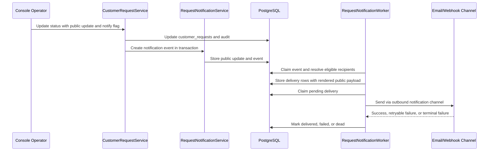

<!-- markdownlint-disable MD013 -->

# Close the Loop Request Notifications

| Field | Value |
|---|---|
| Issue | [#224](https://github.com/Phixsura/attune/issues/224) |
| Status | Implemented |
| Started | 2026-07-16T10:50:28+08:00 |
| Related | [#202](https://github.com/Phixsura/attune/issues/202), [#212](https://github.com/Phixsura/attune/issues/212), [#215](https://github.com/Phixsura/attune/issues/215), [#220](https://github.com/Phixsura/attune/issues/220), [#221](https://github.com/Phixsura/attune/issues/221), [#222](https://github.com/Phixsura/attune/issues/222), [Customer Requests](./2026-07-07-customer-requests.md), [Public Visibility and Moderation Policy](./2026-07-10-public-visibility-moderation-policy.md), [End-User Feedback Submission Portal](./2026-07-11-end-user-feedback-submission-portal.md), [Public Voting Board](./2026-07-13-public-voting-board-mvp.md), [Public Roadmap](./2026-07-14-public-roadmap-from-workflow-states.md), [Reply Draft Review Send Workflow](./2026-07-03-reply-draft-review-send-workflow.md) |

## Problem

Attune can now collect feedback, promote it into Customer Requests, publish
public-safe request profiles, accept public votes and comments, and derive a
public roadmap from request workflow state. That creates the visible path from
customer signal to product execution, but it does not yet close the loop with
the people who raised their hands.

Issue #224 asks Attune to notify requesters, voters, and followers when a
request changes state, ships, receives a moderator response, needs more
information, or is included in a shipped changelog post. This is a
cross-cutting product and platform capability because it touches public
identity, consent, public-safe rendering, delivery infrastructure, retry,
audit, Console workflow, and the existing outbound adapter framework.

The current system has strong foundations, but they are not enough by
themselves:

- `customer_requests.status` is the canonical lifecycle state, and updates are
  audited, but request status changes do not enqueue customer-facing
  notifications.
- `customer_request_votes` records interest, but public votes are currently
  represented by tenant-scoped visitor subjects, not necessarily contactable
  recipients.
- Portal submissions preserve display name and organization identity, but they
  do not yet collect an explicit notification address and consent choice.
- `notify_outbox` is feedback-centric: every row requires a `feedback_id`, and
  the outbound envelope centers on a `feedback` payload.
- The reply-send workflow has delivery logs and retry behavior, but it is
  intentionally scoped to reviewed feedback replies and does not model
  requester/voter/follower subscriptions.
- Public visibility and moderation define what can be shown, but not who should
  be notified, when, or by which channel.

The product risk is two-sided. If Attune sends too little, customers never see
that their feedback mattered. If it sends too freely, it leaks private planning
metadata, ignores consent, or teaches customers to distrust Attune-generated
updates. A world-class design must make the safe path the default path.

## Goals

- Notify requesters, voters, followers, and linked-feedback submitters when a
  request reaches a customer-relevant milestone.
- Support request status change, shipped request, shipped changelog post,
  need-info, and moderator response triggers.
- Start with email and webhook delivery while keeping the delivery model open
  to in-app, Slack, RSS, and digest channels.
- Add a durable recipient and subscription graph that distinguishes interest
  from consent and deliverability.
- Add explicit per-request and global unsubscribe behavior.
- Render notifications only from public-safe request profiles and published
  public update content.
- Enforce public visibility, moderation, recipient consent, and unsubscribe
  gates before creating delivery rows.
- Add delivery logs, retry, dead-letter visibility, manual retry, and audit
  coverage.
- Keep the existing feedback-enrichment outbox stable.
- Give Console operators a previewable workflow with recipient counts, content
  preview, channel health, and a send/no-send control.

## Non-goals

- Do not build a full marketing automation product, campaign builder, CRM, or
  email newsletter system.
- Do not replace the reply-draft review-send workflow.
- Do not expose internal Customer Request details, raw feedback, CRM fields,
  scoring explanations, owner data, audit entries, or delivery issues to end
  users.
- Do not require anonymous public voters to become contactable unless they
  explicitly provide a notification address and consent.
- Do not guarantee inbox placement after Attune hands a message to a configured
  email provider.
- Do not make `notify_outbox.feedback_id` nullable as a shortcut unless a later
  migration deliberately generalizes that queue for every outbound event type.
- Do not make public changelog authoring a broad release-notes suite in this
  issue. The shipped-notification surface needs enough changelog/update shape
  to close the loop for linked requests.

## Current State

### Customer Requests

Customer Requests already have the lifecycle vocabulary needed for product
milestone notifications:

- `open`
- `planned`
- `in_progress`
- `shipped`
- `cancelled`

The request service records old and new status values in audit metadata. Public
roadmap projection also refreshes when `customer_requests.status` changes.
What is missing is a durable notification event created from that same state
transition.

### Public Visibility

The public visibility layer already owns the trust boundary:

- tenant public access policy;
- request, roadmap, changelog, and submission public surfaces;
- public request profile allowlists;
- moderation subjects;
- public request list, detail, roadmap, vote, unvote, and comment routes.

This is the correct layer to reuse for notification rendering. Customer-facing
messages must not render from the internal `CustomerRequestDetail` contract.

### Portal Identity

The current portal can create anonymous or identified submissions with display
name and organization fields, and public votes are associated with a signed
visitor subject. That is enough for dedupe and public voting, but not enough
for email. The notification model needs a contactable identity that is collected
with a clear consent choice and can be removed or suppressed independently of
the vote ledger.

### Outbound

The outbound package is the right adapter family for notification delivery, but
the existing feedback outbox path is shaped around enriched feedback events:

- `notify_outbox.feedback_id` is required.
- `outbound.Envelope` has a `feedback` payload.
- the outbox worker claims delivery rows by feedback destination target.
- email is present as a historical destination constant, but no outbound email
  adapter is active.

Close-the-loop request notifications should reuse the outbound adapter style,
transport, signing, response classification, and metrics discipline without
forcing request events through the feedback-specific table.

### Reply Send

The reply-draft workflow has a strong delivery precedent: explicit send hooks,
delivery attempts, retryable and terminal failures, tests, redelivery, and
audit. Its proposal explicitly kept it separate from `notify_outbox`. Request
notifications should follow the same observability posture while modeling a
different product workflow.

## Industry Synthesis

Twenty leading products converge on the same architecture: they do not treat a
status change as a raw email blast. They build an interest graph, require
public update content, filter by visibility and consent, then deliver through a
channel-aware system with operator controls.

| Product | Observed pattern | Decision for Attune |
|---|---|---|
| Canny | Status changes can notify voters; changelog emails notify subscribers; private board access gates delivery. | Add a send toggle, visibility gate, and separate changelog subscription scope. |
| Productboard | Portal card updates can email voters, requesters, and linked insight submitters; email preview is available before publish. | Model public updates as first-class notification content and preview recipients. |
| Linear Customer Requests | Teams subscribe to customers and receive request activity notifications. | Support customer/account-level subscriptions beyond single-request followers. |
| Jira Product Discovery | Work item events route to configured users and roles, with watcher, assignee, and reporter defaults. | Keep internal notification rules separate from end-user consent. |
| UserVoice | Supporters automatically subscribe to public status updates, and PMs choose whether to email supporters while posting a status message. | Bind status, public message, and send decision into one workflow. |
| Aha! Ideas | Submit, vote, comment, subscribe, proxy vote, status change, admin response, and comments all participate in portal email subscriptions; emails support per-idea and global unsubscribe. | Use source-aware subscriptions and two-level unsubscribe. |
| Featurebase | Status emails target upvoters; linked Jira or Linear issue transitions can trigger updates; update emails respect opt-in, opt-out, segments, language, and all-email unsubscribe. | Store event source, consent mode, segment hooks, locale, and suppression state explicitly. |
| Nolt | Status changes generate comments, and notification targets are OP, commenters, upvoters, and subscribers; merge notifications distinguish source and target audiences. | Treat public updates as durable activity and dedupe recipients by source. |
| Sleekplan | Private board access filters emails; emails include unsubscribe; changelog queue can batch multiple updates into one message. | Add access filtering, unsubscribe links, and a path to digest/batching. |
| Pendo Feedback | Released requests populate a release log and can be communicated through portal, widget, and engagement email surfaces. | Make shipped notifications create a durable release/update record. |
| Frill | Idea board, roadmap, follow/react, and changelog subscribers live in one product family. | Share visibility and subscription rules across board, roadmap, and update surfaces. |
| ProductLift | A roadmap item moving to shipped becomes a changelog item and notifies voters. | Treat shipped as a changelog/update publication opportunity, not only a status label. |
| AnnounceKit | One update can publish to changelog, in-app widget, email, Slack, RSS, webhook, and custom SMTP. | Keep the delivery interface channel-neutral from the start. |
| Beamer | Email auto-subscription depends on existing application email consent; users who opt out are not auto-subscribed. | Do not infer consent from a discovered email address. |
| LaunchNotes | Roadmap item subscribers receive stage-change notifications; announcements have explicit subscriber notification flags; webhooks cover subscriber lifecycle events. | Make notify-subscribers explicit and audit subscriber lifecycle changes. |
| Upvoty | Changelog posts can auto-notify voters whose requested feature shipped. | Use request-to-update links to target voters precisely. |
| Productlane | Customer portal, Linear requests, public roadmap, changelog, email, Slack, and in-app updates stay synced to execution state. | Let external issue status transitions create request notification events through the request service. |
| Qualtrics | Closed loop programs combine tickets, users, surveys, dashboards, and direct follow-up. | Treat need-info and moderator response as workflow events with accountability. |
| Medallia | Closed-loop alerts route high-risk feedback to the teams able to act. | Keep internal owner alerts and customer notifications as sibling workflows. |
| PostHog | Requesters and approvers receive email and in-app notifications for approval lifecycle events; roadmap subscribers can be selected for outreach. | Support both automatic lifecycle notifications and operator-selected cohorts. |

The durable lessons are:

- interest is not consent;
- subscriptions are not delivery attempts;
- public visibility is a hard precondition;
- update copy is a product artifact;
- channel delivery must be observable;
- shipped work deserves a permanent public record;
- operators need preview and control before sending messages that speak for the
  product team.

## Design Principles

1. **Public-safe by construction.** Notification renderers consume public
   profiles and public updates only.
2. **Consent before delivery.** A contact address does not imply permission to
   send.
3. **Humans and integrations are separate planes.** Human contacts carry
   consent, unsubscribe, and suppression state. Tenant webhook targets carry
   integration configuration, signing, and retry policy.
4. **Interest graph before channel routing.** Requesters, voters, followers,
   and linked-feedback submitters are selected before human email delivery is
   chosen. Tenant webhook targets are resolved separately as integration routes.
5. **One event, many recipients, many deliveries.** The event records what
   happened; recipient rows record who is eligible; delivery rows record channel
   attempts.
6. **Operator confirmation for customer-facing milestones.** Status changes can
   create drafts, previews, or published notifications, but the workflow must
   make customer-facing copy visible before send.
7. **At-least-once delivery with dedupe keys.** Webhook consumers and email
   providers must receive stable event and delivery identifiers.
8. **No silent failure.** Retryable and terminal failures are visible in
   Console and auditable.
9. **Email compliance is part of the product.** Bounces, complaints,
   unsubscribe headers, consent evidence, sender verification, and suppression
   are not optional implementation details.
10. **Backfill without surprise.** Existing votes and feedback can become
   interest records, but they do not become email recipients without a
   deliverable contact and consent.

## Proposal

### 1. Introduce a request notification bounded context

Add a new service and repo boundary:

```text
internal/repo/requestnotification
internal/service/requestnotification
internal/handlers/console/requestnotification
internal/handlers/portal/requestnotification
```

The service owns:

- human notification contacts;
- tenant webhook targets;
- request and update subscriptions;
- public update and changelog artifacts;
- notification events;
- delivery rows;
- unsubscribe tokens;
- recipient preview and dedupe;
- delivery retry and audit orchestration.

The Customer Request service should not send messages directly. It should
record request changes, create a notification event or draft through the new
service inside the same transaction, and let the notification dispatcher decide
which recipients and deliveries are eligible.

### 2. Add human contact, webhook target, and subscription storage

Add a privacy-aware contact table for end-user email addresses. This table
represents humans, not integrations:

```sql
CREATE TABLE customer_notification_contacts (
    id                    UUID PRIMARY KEY DEFAULT gen_random_uuid(),
    tenant_id             TEXT NOT NULL REFERENCES tenants(id) ON DELETE CASCADE,
    subject_key           TEXT NOT NULL DEFAULT '',
    subject_hash          TEXT NOT NULL DEFAULT '',
    display_name          TEXT NOT NULL DEFAULT '',
    organization          TEXT NOT NULL DEFAULT '',
    email_hash            TEXT NOT NULL,
    email_payload         BYTEA NOT NULL,
    email_verified_at     TIMESTAMPTZ,
    consent_state         TEXT NOT NULL CHECK (consent_state IN (
                              'unknown',
                              'opted_in',
                              'opted_out',
                              'suppressed'
                            )),
    consent_source        TEXT NOT NULL DEFAULT '',
    consent_text_version  TEXT NOT NULL DEFAULT '',
    legal_basis           TEXT NOT NULL DEFAULT '',
    consented_at          TIMESTAMPTZ,
    locale                TEXT NOT NULL DEFAULT '',
    timezone              TEXT NOT NULL DEFAULT '',
    bounced_at            TIMESTAMPTZ,
    complained_at         TIMESTAMPTZ,
    suppressed_at         TIMESTAMPTZ,
    suppression_reason    TEXT NOT NULL DEFAULT '',
    created_at            TIMESTAMPTZ NOT NULL DEFAULT NOW(),
    updated_at            TIMESTAMPTZ NOT NULL DEFAULT NOW(),
    UNIQUE (tenant_id, id),
    UNIQUE (tenant_id, email_hash)
);
```

`email_payload` stores the deliverable address in an encrypted envelope.
`email_hash` supports dedupe and lookup without logging or indexing a raw email
address. Logs and audit metadata should use `email_hash` plus a redacted display
value, never the raw address.

Add a separate table for tenant-owned webhook integrations:

```sql
CREATE TABLE customer_notification_webhook_targets (
    id                          UUID PRIMARY KEY DEFAULT gen_random_uuid(),
    tenant_id                   TEXT NOT NULL REFERENCES tenants(id) ON DELETE CASCADE,
    name                        TEXT NOT NULL,
    url_payload                 BYTEA NOT NULL,
    url_host                    TEXT NOT NULL DEFAULT '',
    secret_payload              BYTEA,
    signature_version           TEXT NOT NULL DEFAULT 'v1-content-sha256',
    event_mask                  JSONB NOT NULL DEFAULT '{}'::jsonb,
    include_recipient_identity  BOOLEAN NOT NULL DEFAULT false,
    status                      TEXT NOT NULL DEFAULT 'active'
                                  CHECK (status IN ('active', 'disabled', 'suppressed')),
    verified_at                 TIMESTAMPTZ,
    last_tested_at              TIMESTAMPTZ,
    created_by                  TEXT NOT NULL,
    created_at                  TIMESTAMPTZ NOT NULL DEFAULT NOW(),
    updated_at                  TIMESTAMPTZ NOT NULL DEFAULT NOW(),
    UNIQUE (tenant_id, id)
);
```

Webhook targets receive tenant-level event payloads. They do not represent a
single requester or voter, and they do not participate in email unsubscribe
semantics. If a tenant wants recipient identity in webhook payloads, the target
must opt in through `include_recipient_identity`, and that change must be
audited.

Add request subscriptions:

```sql
CREATE TABLE customer_request_subscriptions (
    id                    UUID PRIMARY KEY DEFAULT gen_random_uuid(),
    tenant_id             TEXT NOT NULL REFERENCES tenants(id) ON DELETE CASCADE,
    request_id            UUID,
    account_key           TEXT NOT NULL DEFAULT '',
    contact_id            UUID NOT NULL,
    scope                 TEXT NOT NULL CHECK (scope IN (
                              'request',
                              'tenant_updates',
                              'changelog',
                              'account'
                            )),
    source                TEXT NOT NULL CHECK (source IN (
                              'submitter',
                              'voter',
                              'commenter',
                              'follower',
                              'linked_feedback_submitter',
                              'account_follower',
                              'manual'
                            )),
    event_mask            JSONB NOT NULL DEFAULT '{}'::jsonb,
    status                TEXT NOT NULL CHECK (status IN ('active', 'unsubscribed', 'suppressed')),
    unsubscribed_at       TIMESTAMPTZ,
    created_by            TEXT NOT NULL DEFAULT 'system',
    created_at            TIMESTAMPTZ NOT NULL DEFAULT NOW(),
    updated_at            TIMESTAMPTZ NOT NULL DEFAULT NOW(),
    UNIQUE (tenant_id, id),
    CONSTRAINT fk_customer_request_subscriptions_contact
        FOREIGN KEY (tenant_id, contact_id)
        REFERENCES customer_notification_contacts(tenant_id, id)
        ON DELETE CASCADE,
    CONSTRAINT fk_customer_request_subscriptions_request
        FOREIGN KEY (tenant_id, request_id)
        REFERENCES customer_requests(tenant_id, id)
        ON DELETE CASCADE,
    CONSTRAINT chk_customer_request_subscriptions_scope
        CHECK (
            (scope = 'request' AND request_id IS NOT NULL AND account_key = '') OR
            (scope IN ('tenant_updates', 'changelog') AND request_id IS NULL AND account_key = '') OR
            (scope = 'account' AND request_id IS NULL AND account_key <> '')
        )
);

CREATE UNIQUE INDEX uq_customer_request_subscriptions_request
    ON customer_request_subscriptions (tenant_id, request_id, contact_id, source)
    WHERE request_id IS NOT NULL;

CREATE UNIQUE INDEX uq_customer_request_subscriptions_tenant_scope
    ON customer_request_subscriptions (tenant_id, scope, contact_id, source)
    WHERE request_id IS NULL AND account_key = '';

CREATE UNIQUE INDEX uq_customer_request_subscriptions_account
    ON customer_request_subscriptions (tenant_id, account_key, contact_id, source)
    WHERE request_id IS NULL AND account_key <> '';
```

The nullable `request_id` cases are protected by partial unique indexes so a
tenant-level or account-level subscription cannot be duplicated. Composite
foreign keys keep the subscription, contact, and request in the same tenant at
the database layer.

Subscriptions are stateful records, not disposable join rows. Unsubscribe and
suppression change `status`; hard deletion should be reserved for tenant
deletion or privacy erasure paths that deliberately preserve suppression facts.

`account` scope is reserved for contacts imported from a CRM/support system or
manually confirmed by an operator. The MVP should not synthesize account
followers from `customer_request_customer_links` unless a contact source and
consent source are present.

### 3. Add public update artifacts and request links

Add a customer-facing update artifact. This is the source of truth for content
that can be shown publicly or sent broadly to subscribers:

```sql
CREATE TABLE public_update_threads (
    id                    UUID PRIMARY KEY DEFAULT gen_random_uuid(),
    tenant_id             TEXT NOT NULL REFERENCES tenants(id) ON DELETE CASCADE,
    surface               TEXT NOT NULL CHECK (surface IN (
                              'request_update',
                              'changelog_post'
                            )),
    slug                  TEXT NOT NULL DEFAULT '',
    state                 TEXT NOT NULL DEFAULT 'draft'
                              CHECK (state IN ('draft', 'published', 'archived')),
    public_url            TEXT NOT NULL DEFAULT '',
    created_by            TEXT NOT NULL,
    created_at            TIMESTAMPTZ NOT NULL DEFAULT NOW(),
    updated_at            TIMESTAMPTZ NOT NULL DEFAULT NOW(),
    UNIQUE (tenant_id, id)
);

CREATE UNIQUE INDEX uq_public_update_threads_slug
    ON public_update_threads (tenant_id, slug)
    WHERE slug <> '';

CREATE TABLE public_update_posts (
    id                    UUID PRIMARY KEY DEFAULT gen_random_uuid(),
    tenant_id             TEXT NOT NULL REFERENCES tenants(id) ON DELETE CASCADE,
    thread_id             UUID NOT NULL,
    kind                  TEXT NOT NULL CHECK (kind IN (
                              'status_change',
                              'shipped',
                              'moderator_response',
                              'changelog_post'
                            )),
    state                 TEXT NOT NULL DEFAULT 'draft'
                              CHECK (state IN ('draft', 'published', 'archived')),
    title                 TEXT NOT NULL,
    body                  TEXT NOT NULL,
    locale                TEXT NOT NULL DEFAULT '',
    segment_filter        JSONB NOT NULL DEFAULT '{}'::jsonb,
    visibility            TEXT NOT NULL DEFAULT 'public'
                              CHECK (visibility = 'public'),
    notify_subscribers    BOOLEAN NOT NULL DEFAULT false,
    content_version       INT NOT NULL DEFAULT 1,
    content_hash          TEXT NOT NULL DEFAULT '',
    supersedes_post_id    UUID,
    published_by          TEXT NOT NULL DEFAULT '',
    published_at          TIMESTAMPTZ,
    created_by            TEXT NOT NULL,
    created_at            TIMESTAMPTZ NOT NULL DEFAULT NOW(),
    updated_at            TIMESTAMPTZ NOT NULL DEFAULT NOW(),
    UNIQUE (tenant_id, id),
    UNIQUE (tenant_id, thread_id, content_version),
    CONSTRAINT fk_public_update_posts_thread
        FOREIGN KEY (tenant_id, thread_id)
        REFERENCES public_update_threads(tenant_id, id)
        ON DELETE RESTRICT,
    CONSTRAINT fk_public_update_posts_supersedes
        FOREIGN KEY (tenant_id, supersedes_post_id)
        REFERENCES public_update_posts(tenant_id, id)
        ON DELETE RESTRICT,
    CONSTRAINT chk_public_update_posts_published_fields
        CHECK (
            (state = 'published' AND published_at IS NOT NULL AND published_by <> '') OR
            (state <> 'published')
        )
);

CREATE TABLE public_update_request_links (
    tenant_id             TEXT NOT NULL REFERENCES tenants(id) ON DELETE CASCADE,
    update_id             UUID NOT NULL,
    request_id            UUID NOT NULL,
    role                  TEXT NOT NULL DEFAULT 'primary'
                              CHECK (role IN ('primary', 'related')),
    old_status            TEXT NOT NULL DEFAULT '',
    new_status            TEXT NOT NULL DEFAULT '',
    created_at            TIMESTAMPTZ NOT NULL DEFAULT NOW(),
    PRIMARY KEY (tenant_id, update_id, request_id),
    CONSTRAINT fk_public_update_request_links_update
        FOREIGN KEY (tenant_id, update_id)
        REFERENCES public_update_posts(tenant_id, id)
        ON DELETE RESTRICT,
    CONSTRAINT fk_public_update_request_links_request
        FOREIGN KEY (tenant_id, request_id)
        REFERENCES customer_requests(tenant_id, id)
        ON DELETE RESTRICT
);
```

`public_update_threads` owns the stable public surface identity: surface, slug,
URL, and archived state. Draft threads can have an empty slug; non-empty slugs
are unique per tenant. `public_update_posts` owns one immutable content version
inside a thread. Published post rows are customer-facing artifacts, not
internal notes, and must pass artifact hygiene rules.

A shipped changelog post can link to multiple requests through
`public_update_request_links`, and each linked request keeps its own old/new
status snapshot for rendering and audit. Editing a published update creates a
new `public_update_posts` row on the same thread with an incremented
`content_version` and `supersedes_post_id`; old delivery rows keep their
original rendered payload. This prevents the Productboard-style problem where
already-sent emails disagree with the current public page without any history
explaining why.

The MVP only supports `visibility = 'public'` because the current runtime public
policy supports public surfaces, not signed private-link access. A private-link
surface should be added only with a separate signed-token or ACL design.

Need-info messages that are private to a submitter should not use
`public_update_posts`. They should use a separate direct follow-up record:

```sql
CREATE TABLE request_direct_followups (
    id                    UUID PRIMARY KEY DEFAULT gen_random_uuid(),
    tenant_id             TEXT NOT NULL REFERENCES tenants(id) ON DELETE CASCADE,
    request_id            UUID,
    feedback_id           BIGINT,
    subscription_id       UUID,
    contact_id            UUID NOT NULL,
    kind                  TEXT NOT NULL CHECK (kind IN ('need_info', 'moderator_response')),
    body                  TEXT NOT NULL,
    state                 TEXT NOT NULL DEFAULT 'draft'
                              CHECK (state IN ('draft', 'sent', 'archived')),
    created_by            TEXT NOT NULL,
    sent_at               TIMESTAMPTZ,
    created_at            TIMESTAMPTZ NOT NULL DEFAULT NOW(),
    updated_at            TIMESTAMPTZ NOT NULL DEFAULT NOW(),
    UNIQUE (tenant_id, id),
    CONSTRAINT fk_request_direct_followups_contact
        FOREIGN KEY (tenant_id, contact_id)
        REFERENCES customer_notification_contacts(tenant_id, id)
        ON DELETE RESTRICT,
    CONSTRAINT fk_request_direct_followups_subscription
        FOREIGN KEY (tenant_id, subscription_id)
        REFERENCES customer_request_subscriptions(tenant_id, id)
        ON DELETE RESTRICT,
    CONSTRAINT fk_request_direct_followups_request
        FOREIGN KEY (tenant_id, request_id)
        REFERENCES customer_requests(tenant_id, id)
        ON DELETE RESTRICT,
    CONSTRAINT fk_request_direct_followups_feedback
        FOREIGN KEY (tenant_id, feedback_id)
        REFERENCES user_feedback(tenant_id, id)
        ON DELETE RESTRICT,
    CONSTRAINT chk_request_direct_followups_anchor
        CHECK (
            (request_id IS NOT NULL OR feedback_id IS NOT NULL) AND
            (feedback_id IS NOT NULL OR subscription_id IS NOT NULL)
        )
);
```

Direct follow-ups render from the recipient's own submission or linked feedback
context, never from a broad public profile. If the product needs a reviewed
customer reply rather than a request update, the reply-draft workflow remains
the better delivery path.

Direct follow-up creation must prove recipient ownership before inserting the
row. When `feedback_id` is present, the contact subject must match that
feedback's subject identity or a verified linked-feedback submitter
subscription. When only `request_id` is present, `subscription_id` must point
to an active `submitter` or `linked_feedback_submitter` subscription for the
same contact and request. Moderators cannot use this table as a free-form
email composer.

The renderer can include:

- public request title;
- public request summary;
- public state or roadmap label;
- public update title and body;
- public link when the request is visible on a public surface;
- unsubscribe links;
- tenant branding.

The renderer must not include:

- raw feedback;
- source metadata;
- internal `user_id`;
- subject hashes;
- CRM fields;
- revenue;
- decision score;
- owner or reviewer IDs;
- audit entries;
- hidden feedback counts;
- delivery errors;
- internal issue links unless a public changelog explicitly includes them.

### 4. Add notification event and delivery rows

Add notification events with an explicit resolver state machine:

```sql
CREATE TABLE customer_request_notification_events (
    id                    UUID PRIMARY KEY DEFAULT gen_random_uuid(),
    tenant_id             TEXT NOT NULL REFERENCES tenants(id) ON DELETE CASCADE,
    primary_request_id    UUID,
    update_id             UUID,
    direct_followup_id    UUID,
    event_type            TEXT NOT NULL CHECK (event_type IN (
                              'request.status_changed',
                              'request.shipped',
                              'request.need_info_direct',
                              'request.moderator_response',
                              'changelog.post_published'
                            )),
    audience_scope        TEXT NOT NULL CHECK (audience_scope IN (
                              'public_broadcast',
                              'direct_followup'
                            )),
    dedupe_key            TEXT NOT NULL,
    old_status            TEXT NOT NULL DEFAULT '',
    new_status            TEXT NOT NULL DEFAULT '',
    actor_type            TEXT NOT NULL DEFAULT 'system',
    actor_id              TEXT NOT NULL DEFAULT 'system',
    status                TEXT NOT NULL DEFAULT 'pending'
                              CHECK (status IN (
                                'pending',
                                'resolving',
                                'resolved',
                                'failed',
                                'dead'
                              )),
    attempts              SMALLINT NOT NULL DEFAULT 0,
    next_retry_at         TIMESTAMPTZ NOT NULL DEFAULT NOW(),
    claimed_at            TIMESTAMPTZ,
    claimed_by            TEXT NOT NULL DEFAULT '',
    resolved_at           TIMESTAMPTZ,
    last_error            TEXT NOT NULL DEFAULT '',
    recipient_snapshot    JSONB NOT NULL DEFAULT '{}'::jsonb,
    created_at            TIMESTAMPTZ NOT NULL DEFAULT NOW(),
    UNIQUE (tenant_id, id),
    UNIQUE (tenant_id, dedupe_key),
    CONSTRAINT fk_customer_request_notification_events_request
        FOREIGN KEY (tenant_id, primary_request_id)
        REFERENCES customer_requests(tenant_id, id)
        ON DELETE RESTRICT,
    CONSTRAINT fk_customer_request_notification_events_update
        FOREIGN KEY (tenant_id, update_id)
        REFERENCES public_update_posts(tenant_id, id)
        ON DELETE RESTRICT,
    CONSTRAINT fk_customer_request_notification_events_followup
        FOREIGN KEY (tenant_id, direct_followup_id)
        REFERENCES request_direct_followups(tenant_id, id)
        ON DELETE RESTRICT,
    CONSTRAINT chk_customer_request_notification_events_source
        CHECK (
            (audience_scope = 'public_broadcast'
                AND update_id IS NOT NULL
                AND direct_followup_id IS NULL) OR
            (audience_scope = 'direct_followup'
                AND direct_followup_id IS NOT NULL
                AND update_id IS NULL)
        ),
    CONSTRAINT chk_customer_request_notification_events_type_scope
        CHECK (
            (event_type = 'request.need_info_direct' AND audience_scope = 'direct_followup') OR
            (event_type <> 'request.need_info_direct')
        )
);
```

Resolver workers claim `pending` events with `FOR UPDATE SKIP LOCKED`, move
them to `resolving`, create delivery rows, store the recipient snapshot, and
mark the event `resolved`. Retryable resolver failures move the event back to
`pending` with backoff; terminal failures move it to `dead`. This avoids the
half-created-recipient state where an event exists but no operator can see
whether recipient resolution failed, is still running, or was never attempted.

`audience_scope` controls human recipient resolution only. Tenant webhook
targets are resolved independently from active
`customer_notification_webhook_targets` rows whose `event_mask` matches the
event. A single `public_broadcast` event can therefore create both email
deliveries for eligible contacts and webhook deliveries for tenant
integrations.

Add delivery attempts with separate destination paths for human email and
tenant webhook targets:

```sql
CREATE TABLE customer_request_notification_deliveries (
    id                    BIGSERIAL PRIMARY KEY,
    tenant_id             TEXT NOT NULL REFERENCES tenants(id) ON DELETE CASCADE,
    event_id              UUID NOT NULL,
    subscription_id       UUID,
    contact_id            UUID,
    webhook_target_id     UUID,
    channel               TEXT NOT NULL CHECK (channel IN ('email', 'webhook')),
    destination_hash      TEXT NOT NULL,
    payload               JSONB NOT NULL,
    sensitive_payload     BYTEA,
    status                TEXT NOT NULL DEFAULT 'pending'
                            CHECK (status IN ('pending', 'delivered', 'failed', 'dead', 'suppressed')),
    attempts              SMALLINT NOT NULL DEFAULT 0,
    failure_kind          TEXT NOT NULL DEFAULT '',
    http_status           INT,
    last_error            TEXT NOT NULL DEFAULT '',
    dead_reason           TEXT NOT NULL DEFAULT '',
    next_retry_at         TIMESTAMPTZ NOT NULL DEFAULT NOW(),
    trace_id              TEXT NOT NULL,
    created_at            TIMESTAMPTZ NOT NULL DEFAULT NOW(),
    delivered_at          TIMESTAMPTZ,
    claimed_at            TIMESTAMPTZ,
    claimed_by            TEXT NOT NULL DEFAULT '',
    last_manual_retry_at  TIMESTAMPTZ,
    retried_by            TEXT NOT NULL DEFAULT '',
    manual_retry_count    INT NOT NULL DEFAULT 0,
    CONSTRAINT fk_customer_request_notification_deliveries_event
        FOREIGN KEY (tenant_id, event_id)
        REFERENCES customer_request_notification_events(tenant_id, id)
        ON DELETE RESTRICT,
    CONSTRAINT fk_customer_request_notification_deliveries_subscription
        FOREIGN KEY (tenant_id, subscription_id)
        REFERENCES customer_request_subscriptions(tenant_id, id)
        ON DELETE RESTRICT,
    CONSTRAINT fk_customer_request_notification_deliveries_contact
        FOREIGN KEY (tenant_id, contact_id)
        REFERENCES customer_notification_contacts(tenant_id, id)
        ON DELETE RESTRICT,
    CONSTRAINT fk_customer_request_notification_deliveries_webhook_target
        FOREIGN KEY (tenant_id, webhook_target_id)
        REFERENCES customer_notification_webhook_targets(tenant_id, id)
        ON DELETE RESTRICT,
    CONSTRAINT chk_customer_request_notification_deliveries_destination
        CHECK (
            (channel = 'email'
                AND contact_id IS NOT NULL
                AND webhook_target_id IS NULL) OR
            (channel = 'webhook'
                AND webhook_target_id IS NOT NULL
                AND contact_id IS NULL)
        )
);

CREATE UNIQUE INDEX uq_customer_request_notification_deliveries_contact
    ON customer_request_notification_deliveries (event_id, contact_id, channel)
    WHERE contact_id IS NOT NULL;

CREATE UNIQUE INDEX uq_customer_request_notification_deliveries_webhook
    ON customer_request_notification_deliveries (event_id, webhook_target_id, channel)
    WHERE webhook_target_id IS NOT NULL;
```

`payload` is the public, redacted notification envelope used for preview,
webhook delivery, retry, and operator diagnostics. `sensitive_payload` is an
encrypted envelope for data that should not be visible in JSON logs or Console,
such as provider message ids, one-click unsubscribe material, or channel
adapter metadata. Retry sends the same captured content the customer originally
received. That mirrors the preservation guarantee in the feedback outbox while
avoiding raw-address or token leakage.

Notification events and deliveries are retention records. Application code
should archive requests, archive update threads, or anonymize contact payloads
instead of hard-deleting rows that have notification history. The restrictive
foreign keys are intentional: they force privacy erasure and cleanup paths to
preserve the minimum audit and retry facts rather than accidentally cascading
away sent-message evidence.

### 5. Add unsubscribe tokens and suppression rules

Add unsubscribe token storage. Store only a hash of the bearer token in queryable
columns; the raw token string is never stored in plaintext. If a provider or
channel adapter needs the original one-click material after enqueue, keep it in
the encrypted `sensitive_payload` for that delivery.

```sql
CREATE TABLE customer_request_unsubscribe_tokens (
    id                    UUID PRIMARY KEY DEFAULT gen_random_uuid(),
    tenant_id             TEXT NOT NULL REFERENCES tenants(id) ON DELETE CASCADE,
    contact_id            UUID NOT NULL,
    request_id            UUID,
    scope                 TEXT NOT NULL CHECK (scope IN (
                              'request',
                              'tenant',
                              'changelog'
                            )),
    purpose               TEXT NOT NULL DEFAULT 'unsubscribe'
                              CHECK (purpose IN ('unsubscribe', 'preferences')),
    token_version         TEXT NOT NULL DEFAULT 'v1',
    token_hash            TEXT NOT NULL UNIQUE,
    used_by_user_agent    TEXT NOT NULL DEFAULT '',
    expires_at            TIMESTAMPTZ,
    used_at               TIMESTAMPTZ,
    created_at            TIMESTAMPTZ NOT NULL DEFAULT NOW(),
    CONSTRAINT fk_customer_request_unsubscribe_tokens_contact
        FOREIGN KEY (tenant_id, contact_id)
        REFERENCES customer_notification_contacts(tenant_id, id)
        ON DELETE CASCADE,
    CONSTRAINT fk_customer_request_unsubscribe_tokens_request
        FOREIGN KEY (tenant_id, request_id)
        REFERENCES customer_requests(tenant_id, id)
        ON DELETE CASCADE,
    CONSTRAINT chk_customer_request_unsubscribe_tokens_scope
        CHECK (
            (scope = 'request' AND request_id IS NOT NULL) OR
            (scope IN ('tenant', 'changelog') AND request_id IS NULL)
        )
);
```

Every email must include both body links and standards-compliant headers:

- unsubscribe from this request;
- unsubscribe from all tenant request/update emails;
- a contact preference link when Console exposes preferences.
- `List-Unsubscribe` with HTTPS and mailto forms when supported by the sender;
- `List-Unsubscribe-Post: List-Unsubscribe=One-Click` for one-click capable
  providers.

GET unsubscribe routes must be non-destructive because many mailbox providers
prefetch links. GET renders a confirmation page. POST, one-click POST, or an
authenticated preference action performs the unsubscribe. Token usage is
idempotent, records the effective scope, and never reveals whether another
tenant has the same contact hash.

Email provider bounce and complaint callbacks should update the contact:

- hard bounce sets `bounced_at`, changes deliverability to `suppressed`, and
  stops future email delivery;
- spam complaint sets `complained_at`, changes consent state to `suppressed`,
  and creates an audit event;
- transient provider errors remain delivery failures and follow retry policy;
- manual suppression in Console sets `suppressed_at` and
  `suppression_reason`.

Webhook targets support suppression through Console and API, but webhook
deliveries do not include email-style unsubscribe URLs. They are tenant-owned
integrations controlled through webhook target status and settings.

For email deliveries, suppression is checked in this order:

1. contact lacks a verified email address;
2. contact lacks `opted_in` consent and auditable consent evidence;
3. contact is globally suppressed or opted out;
4. tenant-level unsubscribe applies;
5. request-level unsubscribe applies;
6. event type is disabled for this subscription;
7. bounce or complaint suppression applies;
8. channel is not configured or not verified;
9. visibility or direct-recipient policy denies the message;
10. tenant rate limits or recipient frequency caps block the send.

Public subscription writes should be protected by rate limits on tenant,
request, visitor subject, IP hash, and email hash. A tenant can require
double opt-in for new email contacts; in that mode the first request creates a
pending contact and sends only a verification email. No request update,
changelog, or need-info notification can be delivered until the contact is
verified and consent is recorded.

Privacy operations must treat contacts as first-class personal data. Export
should include contact metadata, consent evidence, subscriptions,
unsubscribes, suppressions, and delivery metadata with public payloads. Delete
should erase encrypted contact payloads and display fields while preserving
hashed suppression/audit facts needed to avoid re-mailing a bounced,
complained, or opted-out address.

### 6. Build a recipient resolver

The recipient resolver takes a notification event and returns an ordered,
deduped recipient set. It should record both eligible and excluded counts in
`recipient_snapshot` so Console can explain why a notification reached a given
audience size.

Recipient sources:

| Source | Inclusion rule | Contact requirement |
|---|---|---|
| `submitter` | Contact created while submitting a portal request or linked portal submission. | Explicit opt-in or tenant policy that accepts existing app consent. |
| `voter` | Contact created while voting or by later subscribing to a voted request. | Explicit opt-in. |
| `commenter` | Contact created while posting a public comment. | Explicit opt-in for comment/status updates. |
| `follower` | Contact clicked subscribe on a public request or was added by an operator. | Explicit opt-in or operator-confirmed consent source. |
| `linked_feedback_submitter` | Linked feedback has a contactable submitter and matching consent. | Verified contact and consent. |
| `account_follower` | Internal customer/account contact follows a customer or account. | Consent source from CRM/support integration or manual operator confirmation. |

If the same contact appears through several sources, the resolver should keep
one delivery row and store the source set in the payload metadata. This prevents
duplicate emails such as "you voted" and "you submitted" for the same person.

Anonymous visitors without contact data remain part of vote counts but are not
deliverable recipients.

`account_follower` is a reserved source until Attune has an explicit contact
source with consent evidence. The resolver must not infer account followers
from request customer links, organization names, domains, or CRM identifiers
alone.

Email delivery eligibility requires all of the following:

- `email_verified_at` is set;
- `consent_state = 'opted_in'`;
- `consent_source`, `consent_text_version`, and `legal_basis` are present;
- `bounced_at`, `complained_at`, and `suppressed_at` are unset;
- no request, tenant, or changelog unsubscribe applies.

`default_consent_mode = 'existing_app_consent'` can satisfy consent only when
the contact row records the external consent source and legal basis. It cannot
turn a discovered email address into a deliverable recipient by itself.

Webhook delivery uses a separate route resolver. It never depends on voter,
requester, follower, or account-follower sources. It selects active tenant
webhook targets by `event_mask`, channel settings, and target verification
state, then creates one delivery per matching target.

### 7. Trigger events from request workflows

The Customer Request service should call the request notification service from
write paths that can create customer-facing milestones.

| Trigger | Source path | Event behavior |
|---|---|---|
| Status change | `customerrequest.Update` where old status differs from new status | Create `request.shipped` when the new status is `shipped` and a published request update exists; otherwise create `request.status_changed` when a published request update exists. |
| Shipped changelog post | public update/changelog publish path | Create `changelog.post_published` linked through `public_update_request_links` to all included requests. |
| Need info | approved direct follow-up for a submitter or linked feedback submitter | Create `request.need_info_direct` with `direct_followup` audience scope. |
| Moderator response | approved admin response on a public request/comment thread | Create `request.moderator_response` from a published public update when the response is broad, or a direct follow-up when it is private to one submitter. |
| External issue transition | GitHub/Linear/Jira sync updates the request status | Flow through the same request update path so notification semantics stay identical. |

The event insert should happen in the same transaction as the state change or
public update publication. A dispatcher claims events after commit, resolves
recipients, creates delivery rows, and lets channel workers deliver them.

Status changes should not send customer-facing messages when no public update
content exists. Console should present a status-change modal that makes the
public message, recipient preview, and send toggle part of the same action. API
callers can provide a public update payload or explicitly choose no
notification.

Dedupe keys must include the customer-facing artifact, not only the status
transition. Recommended keys:

- `request:{request_id}:update:{update_id}:status:{old}:{new}`;
- `request:{request_id}:update:{update_id}:shipped`;
- `changelog:{update_id}:published:{content_version}`;
- `direct:{direct_followup_id}:sent`;
- `sync:{provider}:{provider_event_id}` when an external system provides a
  stable transition id.

Including `update_id`, `direct_followup_id`, or `content_version` lets Attune
send a new customer message when an operator deliberately publishes new copy
for the same request status, while still preventing accidental duplicate sends
from retries or integration replays.

### 8. Enforce visibility gates before delivery

Each event type must pass a visibility policy before deliveries are created.

For broad human request notifications, the request must be:

- in the tenant of the recipient;
- not archived;
- not merged away unless the event is a merge notification;
- backed by an approved public request profile;
- allowed by `portal_access_mode`;
- allowed by `requests_enabled` for request page links;
- allowed by `roadmap_enabled` when the message references roadmap stage;
- allowed by `changelog_enabled` when the message references a changelog post;
- safe to link according to public visibility settings;
- backed by tenant notification settings that enable the event type and
  channel;
- backed by a verified email sender for email delivery;
- rendered from public profile/update content only.

For webhook delivery, the active webhook target, `event_mask`, URL
verification, and target-level identity settings are checked independently of
human recipient gates.

For one-to-one need-info messages tied to a submitter's own private submission,
the message may be sent to that submitter without exposing the request to a
public board. The rendered content in that path must only reference the
recipient's own submission and the operator's public-safe question.

This distinction lets Attune support private follow-up without weakening the
rules for voter and follower broadcasts.

Visibility checks should run before delivery rows are inserted and again at
render/send time. The second check is a guard against races where a request,
public surface, sender, or webhook target is disabled after enqueue but before
delivery. If the second check fails, mark the delivery `suppressed` with a
machine-readable reason instead of attempting the send.

### 9. Extend outbound with a request notification envelope

Add a channel-neutral envelope in `internal/outbound`:

```go
type NotificationEnvelope struct {
    Version      string         `json:"version"`
    Timestamp    string         `json:"timestamp"`
    EventType    string         `json:"event_type"`
    TenantID     string         `json:"tenant_id"`
    Request      map[string]any `json:"request,omitempty"`
    Update       map[string]any `json:"update,omitempty"`
    Recipient    map[string]any `json:"recipient,omitempty"`
    WebhookTarget map[string]any `json:"webhook_target,omitempty"`
    Unsubscribe  map[string]any `json:"unsubscribe,omitempty"`
    DeliveryID   string         `json:"-"`
}

type NotificationChannel interface {
    ID() string
    RenderNotification(envelope *NotificationEnvelope, dst Target) (Rendered, error)
}
```

Keep `EventChannel` and the existing feedback `Envelope` intact so the
feedback enrichment outbox remains stable. Extend the outbound registry rather
than creating a second adapter mechanism:

- `Register` accepts channels that implement `EventChannel`,
  `DigestChannel`, or `NotificationChannel`;
- `LookupNotification(destType string)` returns a registered
  `NotificationChannel`;
- `Channels()` adds a `SupportsNotification` flag;
- notification adapters are still blank-imported only by `cmd/attune`.

This preserves the existing package layering and avoids handler, service, repo,
or notify packages importing adapter implementations directly.

Implement first-class notification channels:

- `raw-webhook`: signed JSON request notification payloads;
- `email`: branded transactional email using a verified tenant sender or
  configured provider.

Email sender configuration should be tenant-scoped and verified before use.
If no verified sender is available, delivery rows should be marked
`suppressed` with a machine-readable failure reason rather than silently
dropping recipients.

Webhook notification payloads should include:

- stable event id;
- stable delivery id;
- webhook target id;
- event type;
- public request id and slug;
- old and new public status labels when applicable;
- public update title/body;
- public URL when allowed;
- recipient source set only when the webhook target explicitly allows
  recipient identity;
- timestamp;
- HMAC signature headers using the existing outbound signing pattern.

Webhook payloads should not include raw email addresses or unsubscribe material
by default. If a tenant integration needs customer identity in webhook payloads,
that must be an explicit per-target setting with audit coverage. Even then, the
payload should prefer contact ids, source sets, and redacted display data over
raw addresses.

### 10. Add delivery workers and Console retry

Add a `RequestNotificationWorker` that:

- claims pending or failed delivery rows with `FOR UPDATE SKIP LOCKED`;
- renders the captured envelope into channel-specific requests;
- sends with `notify.Transport`;
- classifies success, retryable failure, and terminal failure;
- applies exponential backoff and provider `Retry-After` hints;
- marks terminal failures dead;
- emits bounded metrics labels;
- writes structured logs without raw contact data.

Console should expose:

- list deliveries by status, request, event type, channel, and created time;
- delivery detail with public event metadata and redacted recipient display;
- retry one failed/dead delivery;
- retry all failed/dead deliveries for one event;
- suppression reason;
- delivery attempts count and last error;
- trace id for support correlation.

Manual retry should record audit events with before/after delivery state.

### 11. Add tenant settings, sender health, and permissions

Add tenant-scoped notification settings:

```sql
CREATE TABLE customer_notification_settings (
    tenant_id                         TEXT PRIMARY KEY
                                        REFERENCES tenants(id) ON DELETE CASCADE,
    email_enabled                     BOOLEAN NOT NULL DEFAULT false,
    webhook_enabled                   BOOLEAN NOT NULL DEFAULT false,
    enabled_event_types               JSONB NOT NULL DEFAULT '{}'::jsonb,
    status_policy                     JSONB NOT NULL DEFAULT '{}'::jsonb,
    default_consent_mode              TEXT NOT NULL DEFAULT 'disabled'
                                        CHECK (default_consent_mode IN (
                                          'explicit_opt_in',
                                          'existing_app_consent',
                                          'disabled'
                                        )),
    require_public_update_for_status  BOOLEAN NOT NULL DEFAULT true,
    max_recipients_without_confirm    INT NOT NULL DEFAULT 100,
    tenant_hourly_send_limit          INT NOT NULL DEFAULT 1000,
    contact_daily_send_limit          INT NOT NULL DEFAULT 10,
    updated_by                        TEXT NOT NULL DEFAULT '',
    created_at                        TIMESTAMPTZ NOT NULL DEFAULT NOW(),
    updated_at                        TIMESTAMPTZ NOT NULL DEFAULT NOW()
);
```

Add verified sender state for email:

```sql
CREATE TABLE customer_notification_email_senders (
    id                    UUID PRIMARY KEY DEFAULT gen_random_uuid(),
    tenant_id             TEXT NOT NULL REFERENCES tenants(id) ON DELETE CASCADE,
    from_name             TEXT NOT NULL,
    from_email_hash       TEXT NOT NULL,
    from_email_payload    BYTEA NOT NULL,
    reply_to_hash         TEXT NOT NULL DEFAULT '',
    reply_to_payload      BYTEA,
    domain                TEXT NOT NULL,
    dkim_status           TEXT NOT NULL DEFAULT 'pending'
                              CHECK (dkim_status IN ('pending', 'verified', 'failed')),
    spf_status            TEXT NOT NULL DEFAULT 'pending'
                              CHECK (spf_status IN ('pending', 'verified', 'failed')),
    dmarc_status          TEXT NOT NULL DEFAULT 'pending'
                              CHECK (dmarc_status IN ('pending', 'verified', 'failed')),
    provider              TEXT NOT NULL DEFAULT '',
    provider_config       BYTEA,
    status                TEXT NOT NULL DEFAULT 'pending'
                              CHECK (status IN ('pending', 'active', 'disabled', 'failed')),
    verified_at           TIMESTAMPTZ,
    created_by            TEXT NOT NULL,
    created_at            TIMESTAMPTZ NOT NULL DEFAULT NOW(),
    updated_at            TIMESTAMPTZ NOT NULL DEFAULT NOW(),
    UNIQUE (tenant_id, id),
    UNIQUE (tenant_id, from_email_hash)
);
```

Permission checks should be explicit:

| Actor | Allowed actions |
|---|---|
| Tenant admin | Update notification settings, verified senders, webhook targets, suppression state, and global retries. |
| Member with request edit permission | Preview and publish request updates for requests they can edit. |
| Moderator | Create approved moderator responses and direct need-info follow-ups within the public moderation boundary. |
| Service account with `request_notification:write` | Publish integration-originated request updates without bypassing public update, visibility, or consent checks. |
| Public visitor | Subscribe or unsubscribe only their own contact through signed public flows. |

Audit enum constraints must be migrated with the new actions. In this codebase
that means updating the `audit_log.action` CHECK constraint in the same
migration that introduces request notification audit writes; otherwise inserts
will fail after the application starts using the new action names.

### 12. Add public and console API contracts

Extend `.proto` contracts rather than hand-writing JSON-only routes.

Console service candidates:

```proto
service RequestNotificationService {
  rpc GetRequestNotificationSettings(GetRequestNotificationSettingsRequest)
      returns (RequestNotificationSettings);
  rpc UpdateRequestNotificationSettings(UpdateRequestNotificationSettingsRequest)
      returns (RequestNotificationSettings);
  rpc ListRequestNotificationSenders(ListRequestNotificationSendersRequest)
      returns (ListRequestNotificationSendersResponse);
  rpc UpsertRequestNotificationSender(UpsertRequestNotificationSenderRequest)
      returns (RequestNotificationSender);
  rpc VerifyRequestNotificationSender(VerifyRequestNotificationSenderRequest)
      returns (RequestNotificationSender);
  rpc ListRequestNotificationWebhookTargets(ListRequestNotificationWebhookTargetsRequest)
      returns (ListRequestNotificationWebhookTargetsResponse);
  rpc CreateRequestNotificationWebhookTarget(CreateRequestNotificationWebhookTargetRequest)
      returns (RequestNotificationWebhookTarget);
  rpc UpdateRequestNotificationWebhookTarget(UpdateRequestNotificationWebhookTargetRequest)
      returns (RequestNotificationWebhookTarget);
  rpc TestRequestNotificationWebhookTarget(TestRequestNotificationWebhookTargetRequest)
      returns (RequestNotificationWebhookTestResult);
  rpc PreviewRequestNotification(PreviewRequestNotificationRequest)
      returns (PreviewRequestNotificationResponse);
  rpc PublishRequestUpdate(PublishRequestUpdateRequest)
      returns (RequestNotificationEvent);
  rpc ListRequestNotificationDeliveries(ListRequestNotificationDeliveriesRequest)
      returns (ListRequestNotificationDeliveriesResponse);
  rpc RetryRequestNotificationDelivery(RetryRequestNotificationDeliveryRequest)
      returns (RequestNotificationDelivery);
  rpc ListRequestSubscribers(ListRequestSubscribersRequest)
      returns (ListRequestSubscribersResponse);
  rpc SuppressRequestSubscriber(SuppressRequestSubscriberRequest)
      returns (RequestSubscriber);
}
```

Portal service additions:

```proto
service PortalService {
  rpc SubscribePublicCustomerRequest(SubscribePublicCustomerRequestRequest)
      returns (PublicRequestSubscription);
  rpc UnsubscribePublicCustomerRequest(UnsubscribePublicCustomerRequestRequest)
      returns (PublicRequestSubscription);
  rpc ConfirmPublicNotificationContact(ConfirmPublicNotificationContactRequest)
      returns (PublicNotificationContact);
}
```

Voting and submission requests should gain optional contact and consent fields:

- `email`;
- `notify_me`;
- `notification_consent_text_version`;
- `locale`;
- `timezone`.

The unsubscribe endpoint can be a lightweight public HTML handler plus a proto
API for clients:

```text
GET /unsubscribe/request/{token}
GET /notification/confirm/{token}
POST /v1/portal/{tenant_slug}/unsubscribe
POST /v1/portal/{tenant_slug}/notification-contact/confirm
```

The GET path should be safe for email clients that prefetch links. It can render
a confirmation page and require POST to finalize when prefetch risk is high, or
use token confirmation semantics that tolerate prefetch without destructive
changes.

### 13. Console experience

The operator flow should make notification safety visible:

1. Operator changes a request status or posts a public update.
2. Console opens a customer update panel with:
   - public title;
   - public body;
   - request public profile preview;
   - event type;
   - send toggle;
   - channel selector;
   - recipient count;
   - excluded count by reason;
   - preview email/webhook payload.
3. Operator publishes the update.
4. Attune records event, resolves recipients, and creates delivery rows.
5. Console shows event delivery status and failures.

Status updates triggered by integrations should land as notification drafts
when customer-facing copy is missing. Operators can publish with copy and
recipient preview from the request detail page.

### 14. Audit and metrics

Audit actions:

- `request_notification.settings_update`
- `request_notification.sender_verify`
- `request_notification.webhook_target_create`
- `request_notification.webhook_target_update`
- `request_notification.webhook_target_delete`
- `request_notification.webhook_target_test`
- `request_notification.subscribe`
- `request_notification.unsubscribe`
- `request_notification.suppress_contact`
- `request_notification.bounce`
- `request_notification.complaint`
- `request_notification.event_create`
- `request_notification.delivery_retry`
- `request_notification.delivery_dead`
- `request_notification.public_update_publish`

Metrics:

- `attune_request_notification_events_total{event_type}`
- `attune_request_notification_recipients_total{event_type,result}`
- `attune_request_notification_deliveries_total{channel,result,status}`
- `attune_request_notification_delivery_duration_seconds{channel,result}`
- `attune_request_notification_retry_after_total{channel}`
- `attune_request_notification_dead_rows`
- `attune_request_notification_lag_seconds`

Labels must not include tenant ids, URLs, raw emails, request titles, or raw
provider errors.

## Data Flow



## Alternatives Considered

### Reuse `notify_outbox` by making `feedback_id` nullable

This is tempting because it reuses an existing worker and Console dead-letter
surface. It also couples a request notification domain to a queue whose schema,
payload, comments, indexes, and display assumptions are all feedback-centric.
The safer approach is to add a request notification delivery table and reuse
the outbound rendering and transport patterns.

### Send directly from `customerrequest.Update`

Direct sending makes the first demo easy but loses transactional durability,
retry, dedupe, audit, and operator visibility. It also makes it harder to block
private metadata leaks because rendering would be mixed into the request
service.

### Treat every voter as subscribed

Votes express interest, but they do not prove consent or deliverability. Public
visitor votes are cookie-backed and often anonymous. The system should keep
vote counts separate from contactable subscriptions.

### Use changelog subscribers only

Changelog subscribers are useful for broad release communication, but they miss
the most important close-the-loop audience: people tied to a specific request.
The recipient graph needs both request-specific and changelog-level scopes.

### Webhook-only MVP

Webhooks are valuable for customer systems and tenant automation, but #224
explicitly asks for email and webhook delivery. A webhook-only cut would also
miss the product category norm: requesters and voters expect direct email or
in-app notification when their request ships.

### Render from internal Customer Request details

This would leak private context. The public request profile and public update
copy already exist to prevent that class of mistake. Notification rendering
should consume those public-safe records only.

## Risks And Tradeoffs

| Risk | Impact | Mitigation |
|---|---|---|
| Email deliverability is poor without verified sending identity. | Customers miss updates or messages land in spam. | Require verified sender config before email delivery; expose suppression reason. |
| Existing votes do not have email consent. | Early recipient counts may look lower than vote counts. | Show eligible, uncontactable, and unsubscribed counts separately. |
| Public/private boundary is subtle for need-info messages. | A private request could be leaked to a broad audience. | Restrict private need-info to the original submitter and render only their own submission context. |
| Multiple sources point to one contact. | Duplicate emails erode trust. | Deduplicate by contact hash and event id; record source set. |
| Status integrations create noisy drafts. | Operators see too many pending updates. | Tenant settings can choose which statuses are customer-facing and which require a public update. |
| Email addresses become sensitive stored data. | Privacy and breach impact increase. | Encrypt contact payloads, hash for dedupe, redact logs, include deletion/suppression paths. |
| New worker adds operational surface. | More code and monitoring. | Reuse `notify.Transport`, outbound response classification, retry conventions, metrics style, and Console dead-letter patterns. |

## Implementation Plan

This should land as one PR. The work can still be reviewed in coherent commits,
but the PR should not merge a partially wired notification product. Database
storage, proto contracts, service logic, workers, handlers, Console surfaces,
tests, proposal, and changelog entry move together.

Default behavior is off. New tenant settings start with `email_enabled = false`
and `webhook_enabled = false`, and no delivery row can be sent without verified
sender or active webhook target configuration. This lets the PR include the
complete #224 scope while keeping existing tenants unaffected.

### Single PR scope contract

The PR must deliver these user-visible paths end to end:

- portal users can provide email consent while submitting, voting, commenting,
  or subscribing;
- operators can publish a request update or shipped changelog update, preview
  recipients, and choose whether to notify;
- eligible requesters, voters, followers, and linked-feedback submitters can
  receive email when verified sender configuration exists;
- active tenant webhook targets can receive signed public notification payloads;
- recipients can unsubscribe from a request, tenant request/update emails, or
  changelog emails through prefetch-safe public flows;
- operators can see delivery status, suppression reasons, failed/dead rows, and
  manually retry eligible deliveries.

The same PR should not attempt to add Slack, RSS, in-app notification feeds,
daily digests, CRM contact import, private-link sharing, or broad release-notes
authoring. The schema and outbound interfaces can remain channel-neutral, but
only email and raw webhook behavior are enabled and tested for #224.

The PR is not mergeable until all of the following are true:

- tenant defaults keep request notifications inert on existing deployments;
- no code path can send email without verified contact, opted-in consent,
  consent evidence, and verified sender state;
- no code path can send public broadcasts without published public-safe update
  content;
- no direct follow-up can target a contact that does not own the submission or
  active submitter subscription;
- webhook payloads are signed, redacted, and independent from human recipient
  unsubscribe semantics;
- delivery failures are visible, retryable when safe, and retained for audit;
- generated code, tests, changelog, and this proposal are committed together.

### Workstream 1: Contracts, migrations, and generated code

- Add one migration for the request notification schema: contacts, webhook
  targets, subscriptions, public update threads, public update posts, request
  links, direct follow-ups, events, deliveries, unsubscribe tokens, tenant
  settings, and email sender state.
- Include partial unique indexes, composite tenant FKs, restrictive retention
  FKs, event state fields, event/delivery claim indexes, and the
  `audit_log.action` CHECK constraint update.
- Add `request_notification.proto` for Console APIs and extend portal/customer
  request protos for subscription contact fields and publish hooks.
- Run `make proto` and commit generated Go, TS, and OpenAPI output.
- Add or update error-code enum values only through proto generation.

### Workstream 2: Repo package and storage invariants

- Add `internal/repo/requestnotification` with focused methods for settings,
  contacts, webhook targets, subscriptions, public updates, follow-ups, events,
  deliveries, unsubscribe tokens, sender state, and claim operations.
- Keep repo methods transaction-friendly: public update publication, request
  status changes, direct follow-up send, event creation, and audit writes must
  share one transaction where business state changes.
- Implement contact hashing/encrypted payload boundaries at the service layer,
  while the repo exposes only opaque payload bytes and hash fields.
- Add repo unit tests and PostgreSQL integration tests for partial uniques,
  composite tenant FKs, ownership checks, retention FKs, claim locking, and
  migration backfill.

### Workstream 3: Service orchestration

- Add `internal/service/requestnotification` for settings, sender verification,
  webhook targets, contact capture, subscription creation, public update
  publication, direct follow-up creation, preview, resolver state machine, and
  manual retry.
- Implement email eligibility as verified address plus opted-in consent plus
  consent evidence. Treat existing app consent as valid only when the contact
  row records source, text version, and legal basis.
- Implement recipient resolution separately from webhook route resolution.
  Human recipients come from submitter, voter, commenter, follower,
  linked-feedback submitter, and confirmed account-follower sources. Webhook
  deliveries come from active targets whose `event_mask` matches the event.
- Implement visibility checks by reusing public visibility/public profile
  service contracts. Broad notifications require published public update
  content; direct follow-ups require submitter ownership and render only the
  recipient's own submission context.
- Implement unsubscribe, confirmation, bounce, complaint, suppression, export,
  and anonymize flows with audit coverage.

### Workstream 4: Outbound adapters and workers

- Extend `internal/outbound` with `NotificationEnvelope`,
  `NotificationChannel`, `LookupNotification`, and `SupportsNotification`
  without changing the existing feedback `EventChannel` contract.
- Add notification renderers for signed raw webhook payloads and transactional
  email payloads. Email can use a provider interface backed by HTTPS requests
  and should require verified sender state before delivery.
- Add `RequestNotificationWorker` with separate event-claim and delivery-claim
  loops, `FOR UPDATE SKIP LOCKED`, exponential backoff, provider
  `Retry-After`, terminal failure classification, dead-letter status, metrics,
  and redacted logs.
- Split public `payload` from encrypted `sensitive_payload`; raw emails, raw
  unsubscribe tokens, provider secrets, and provider message ids must not appear
  in logs or Console JSON.

### Workstream 5: Backend API handlers and permissions

- Add Console handlers under `internal/handlers/console/requestnotification`
  for settings, sender verification, webhook target CRUD/test, preview,
  publish, subscriber list, suppression, delivery list/detail, and retry.
- Add Portal handlers under `internal/handlers/portal/requestnotification` for
  public subscribe, unsubscribe, preference confirmation, and contact
  confirmation.
- Extend portal submission, vote, comment, and subscribe flows with optional
  email, consent, locale, and timezone fields.
- Gate Console actions with explicit permissions: tenant admin for settings,
  senders, webhook targets, suppression, and global retries; request editors
  for publish/preview; moderators for direct follow-ups; service accounts with
  `request_notification:write` for integration-originated publication.
- Add audit inventory coverage for every new Console mutation route.

### Workstream 6: Console UI

- Add a request customer-update panel for status change and public update
  publication: public title/body, public profile preview, send toggle, channel
  selector, recipient preview, excluded-count breakdown, and payload preview.
- Add notification settings screens for event types, consent mode, sender
  health, webhook targets, and send limits.
- Add delivery operations screens for event detail, delivery list, failure
  detail, suppression reason, trace id, retry one, and retry all for an event.
- Add portal-facing subscribe/unsubscribe/confirmation screens with
  prefetch-safe semantics and accessible error states.
- Keep Console copy and shipped UI strings in English and avoid internal
  roadmap language.

### Workstream 7: Integration points

- Wire `customerrequest.Update` so status changes can publish an update and
  create a notification event in the same transaction.
- Wire changelog/public update publication so linked requests create
  `changelog.post_published` events.
- Wire direct follow-up publication through request notification service; use
  reply-draft workflow instead when the operator is replying to feedback rather
  than publishing a request notification.
- Wire workers at application startup with existing `notify.Transport` egress
  policy and metrics setup.
- Add tenant settings defaults so installs remain inert until an operator
  configures channels.

### Workstream 8: Verification and review packaging

- Keep commits reviewable by layer: migration/proto, repo, service, outbound,
  handlers, Console, integration tests, docs/changelog.
- Run focused tests after each layer lands locally, then run `make ci-check`
  before marking the PR ready.
- Include a PR description checklist that calls out `Closes #224`, proposal
  link, changelog entry, new migrations, generated code, privacy assumptions,
  consent assumptions, and verification output.
- Do not stage unrelated local changes. The proposal doc and implementation
  changes should be the only files included unless generated code requires
  additional outputs.

### PR-internal delivery order

| Order | Commit group | Local gate before continuing |
|---|---|---|
| 1 | Proposal update, changelog entry, migration, proto, generated code | `make proto`, migration tests, artifact lint |
| 2 | Repo package and storage invariants | repo unit tests and PostgreSQL integration tests for indexes, FKs, and claim locking |
| 3 | Service orchestration, recipient resolver, webhook route resolver | service unit tests for eligibility, visibility, dedupe, and direct ownership |
| 4 | Outbound notification registry, renderers, worker | outbound conformance tests and worker retry/dead-letter tests |
| 5 | Console and Portal handlers with audit inventory | handler tests for permissions, validation, unsubscribe, retry, and audit route coverage |
| 6 | Console and Portal UI | TypeScript, component tests, and payload-preview redaction tests |
| 7 | End-to-end integration and privacy hardening | request-to-update-to-delivery integration tests and privacy negative tests |
| 8 | Final sweep | `make ci-check`, `scripts/lint-artifacts.sh --strict`, PR checklist |

### Issue acceptance mapping

| #224 acceptance point | Required implementation evidence |
|---|---|
| Voters and requesters are notified when a request ships or changes status. | Public update publish path creates events; resolver selects verified request-specific contacts; email and webhook deliveries are created; integration tests cover status and shipped paths. |
| Notifications obey visibility, consent, and unsubscribe settings. | Resolver requires public profile/update visibility, verified contact, opted-in consent evidence, no suppression, no applicable unsubscribe, enabled event/channel settings, and verified sender or active target. |
| Failures are visible and retryable. | Delivery rows store status, attempts, failure kind, last error, trace id, dead reason, manual retry metadata, and Console retry APIs. |
| Messages do not expose private request metadata. | Renderers consume public profiles and published update posts only; payload/log tests reject raw feedback, internal ids, CRM fields, owner ids, provider secrets, and raw unsubscribe tokens. |

### Single-PR risk controls

| Risk | Control inside this PR |
|---|---|
| PR becomes too large to review. | Keep commit groups aligned to workstreams and require each group to pass its local gate before moving on. |
| Partial backend ships without UI or operators cannot inspect failures. | Merge only after Console preview, settings, delivery list, and retry screens are present. |
| Email delivery is not ready but schema and workers exist. | Tenant email stays disabled until sender verification passes; unverified delivery rows become `suppressed`, not sent. |
| Webhook delivery accidentally fans out per human recipient. | Webhook route resolver creates one delivery per active target, independent of human recipient resolution. |
| Privacy fixes are treated as cleanup. | Privacy export/anonymize, suppression, redaction, and negative tests are part of the required PR gate. |

## Verification

- `go test ./internal/repo/requestnotification ./internal/service/requestnotification`
- Handler tests for console preview, publish, retry, unsubscribe, and portal
  subscribe flows.
- Permission tests for settings, sender verification, webhook target
  management, public update publish, direct follow-up publish, and retry.
- Integration tests under `test/integration/postgres/requestnotification/` for
  transactionality, claim locking, retry, dead-letter, unsubscribe, partial
  unique indexes, composite tenant FKs, and event resolver recovery.
- Public update tests for thread/version behavior: many empty-slug drafts per
  tenant, unique non-empty slugs, immutable published posts, superseded versions,
  and request links tied to the sent post version.
- Direct follow-up tests proving a row cannot be inserted without request or
  feedback context, cannot target a contact that does not own the submission or
  active submitter subscription, and cannot be used as a free-form email path.
- Webhook route tests proving one public event can create both human email
  deliveries and tenant webhook deliveries without changing `audience_scope`.
- Outbound registry tests for `NotificationChannel` registration,
  `LookupNotification`, duplicate id handling, and `SupportsNotification`.
- Privacy negative tests proving no delivery is created for hidden requests,
  unapproved public profiles, disabled request/changelog/roadmap surfaces,
  missing verified sender, inactive webhook target, opted-out contacts,
  unverified contacts, unknown-consent contacts, bounced contacts, complained
  contacts, or cross-tenant subscriptions.
- Retention tests proving requests, public update posts, events, and deliveries
  with notification history are archived or anonymized rather than cascaded away
  through ordinary application delete paths.
- Dedupe tests proving retries do not duplicate deliveries and a new published
  update version can intentionally create a new event.
- Email compliance tests for `List-Unsubscribe`,
  `List-Unsubscribe-Post`, prefetch-safe GET, one-click POST, bounce callbacks,
  complaint callbacks, and token-hash-only storage.
- Unit coverage for one-click email headers, provider bounce/complaint
  suppression, tenant-hourly and contact-daily rate-limit suppression, and
  large-audience publish confirmation.
- Webhook tests proving tenant targets receive signed public payloads, do not
  receive unsubscribe material, and do not receive recipient identity unless
  `include_recipient_identity` is enabled.
- Payload tests proving raw email addresses, raw unsubscribe tokens, internal
  request fields, audit data, CRM fields, owner ids, and provider secrets stay
  out of `payload` and logs.
- `make proto` and generated Go/TS/OpenAPI diff committed.
- Console tests for recipient preview, public update modal, delivery list, and
  retry flows.
- `scripts/lint-slog.sh --strict`
- `scripts/lint-rawptr.sh`
- `scripts/lint-errorcode.sh`
- `scripts/lint-integration-layout.sh`
- `scripts/lint-artifacts.sh --strict`
- `go vet ./...`
- `go build ./...`
- `go test -race ./...`
- `pnpm tsc -b --noEmit`
- `pnpm biome check`
- `pnpm vitest run --coverage`
- `make ci-check`

## References

- [#224](https://github.com/Phixsura/attune/issues/224)
- [#202](https://github.com/Phixsura/attune/issues/202)
- [Canny status change emails](https://help.canny.io/en/articles/1291127-status-change-emails)
- [Canny changelog emails](https://help.canny.io/en/articles/9346252-changelog-emails)
- [Productboard Portal card updates](https://support.productboard.com/hc/en-us/articles/360058173353-Close-the-feedback-loop-with-Portal-card-updates)
- [Productboard notifications](https://support.productboard.com/hc/en-us/articles/360058174273-How-notifications-work)
- [Linear Customer Requests](https://linear.app/customer-requests)
- [Jira Product Discovery notifications](https://support.atlassian.com/jira-product-discovery/docs/manage-your-space-notifications/)
- [UserVoice public status updates](https://help.uservoice.com/hc/en-us/articles/360034984834-Public-Status-Updates-on-Ideas)
- [Aha! Ideas portal notification emails](https://support.aha.io/aha-ideas/support-articles/ideas-management/portal-notification-emails)
- [Featurebase status updates and emails](https://help.featurebase.app/articles/8002760-status-updates-and-emails)
- [Featurebase update subscriptions](https://help.featurebase.app/articles/2705284-subscribing-users-to-changelogs)
- [Nolt board email notifications](https://nolt.io/help/email-notifications)
- [Sleekplan end-user emails](https://help.sleekplan.com/en/articles/5395792-e-mails-we-send-to-your-end-users)
- [Sleekplan changelog notifications](https://help.sleekplan.com/en/articles/8050522-changelog-notifications-keeping-your-customers-informed)
- [Pendo communicate releases](https://support.pendo.io/hc/en-us/articles/360034133871-Communicate-releases)
- [LaunchNotes roadmap notifications](https://updates.launchnotes.com/announcements/available-today-early-access-to-roadmap-notifications)
- [LaunchNotes API documentation](https://developer.launchnotes.com/index.html)
- [LaunchNotes webhooks](https://updates.launchnotes.com/board/webhooks)
- [Beamer auto-subscribe users](https://help.userflow.com/beamer/docs/auto-subscribe-users-to-email-updates)
- [Beamer idea status update alerts](https://help.userflow.com/beamer/docs/how-do-you-notify-a-customer-once-the-status-of-the-idea-is-changed)
- [AnnounceKit product communication platform](https://announcekit.app/)
- [AnnounceKit integrations](https://announcekit.app/integrations)
- [Upvoty feedback platform](https://www.upvoty.com/)
- [Productlane customer platform](https://productlane.com/)
- [Qualtrics closing the loop](https://www.qualtrics.com/support/vocalize/common-use-cases-voc/closing-the-loop/)
- [Medallia closed-loop feedback framework](https://www.medallia.com/blog/closed-loop-feedback-program-try-this-framework/)
- [PostHog approvals notifications](https://posthog.com/docs/settings/approvals)
- [PostHog user feedback handbook](https://posthog.com/handbook/product/user-feedback)
